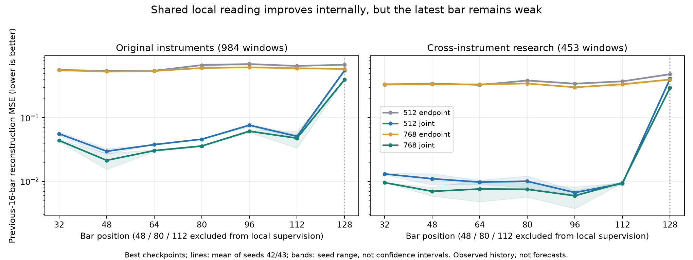

# 逐bar表示收敛矩阵复核：监督有效，末端统一与完整验收仍未完成

结论：多位置联合监督显著改善中间bar状态的共享读取；单纯从512增加到768维不能解决这一问题。但三个新方案均未通过预先登记的完整门槛，按协议保留512_endpoint基线，不晋升768_joint，不继续容量/权重/轮数搜索。最新第128根仍是明显弱点，不能将中间位置成绩当作当前行情状态已经可用。

## 完整性与公平比较

来源`babel_bar_alignment_reports.tar.gz`，SHA256 `13a6c20c8b66a18c32ca8aa1b7fdb4acdc9cefdc12c0949e0df84f847e1f77fd`。训练实现31cac53，all退出0、complete。RTX3080Ti、PyTorch2.8.0+cu128、NumPy2.3.2，两worker并行；18:21:10至19:41:00，约1小时20分钟。

- 八格均完成200轮、每轮4789窗口/38次更新，每格编码器7600步、头7600步，合计分别60800步；每格957800窗口、3831200局部目标曝光。不是复用旧模型与短训练候选的不公平比较。
- 核对当前归档48项可用文件指纹，18项权重/PCA二进制引用按协议未附带；源码身份、上游shared报告及原sampling计划匹配。1600条历史的窗口与位置计划可重算，同种子四格完全一致；两种子分别恢复，48/80/112直接局部曝光为0。
- 重算包括epoch0的选模：512_endpoint42/43为196/199，512_joint为200/199，768_endpoint为200/198，768_joint为200/200。初始配对签名相同，16份best/last验证回放记录通过。跨平台cos学习率计算最大约1.1e-19的末位差异，未发现日程或预算不匹配。
- 重算2048项误差均值、720项配对指标及19080个分组、位置聚合及最终decision，均与导出一致。最终结果仍为`retain_baseline_and_stop`，没有事后更改门槛。
- 本轮512_endpoint固定末轮与原sampling两种子固定末轮，在两研究集共40个逐窗口全局指标数组完全相同，最大绝对差0。说明新增的隔离读出头未改变这些观测误差；这不等价于本地核验了权重逐元素相同。
- AutoDL初始预检的严格前缀最大差8.79e-7；endpoint局部梯度隔离、原核心梯度精确一致、joint梯度进入编码器均通过。预检是初始化检查，不冒称训练后权重已在本地重跑因果性验证。归档无权重/原始数组，本地仅重算报告与统计，没有真实模型推理或训练。

## 主要收益来自监督方式

以下为best检查点两个种子的均值，误差越小越好。全局综合与局部综合使用不同的目标及归一化，不互相比较绝对大小。

| 方案 | 原品种全局综合 | 原品种保留位置局部 | 跨品种全局综合 | 跨品种保留位置局部 |
|---|---:|---:|---:|---:|
|512 endpoint|0.140181|0.623677|0.087380|0.367306|
|512 joint|0.142534|0.042205|0.088128|0.010078|
|768 endpoint|0.113918|0.578308|0.068900|0.338047|
|768 joint|0.104560|0.034980|0.062616|0.007991|

512_joint在保留位置48/80/112的局部误差下降93.23%/97.26%，全局综合代价为+1.68%/+0.86%。说明512维本身能够承载本轮的16根局部任务，先前很差的共享读取不能全部归结为容量不足。结论仅适用于本任务，不表示128根全部信息可无损压缩到512维。

768_endpoint的全局综合改善18.74%/21.15%，局部仅改善7.27%/7.97%，且种子43只有约2.5%/3.1%的best局部改善。加宽与提高PCA rank确有全局帮助，但不是局部状态一致性的充分解决办法。768同时改变隐层和固定PCA rank，仍不能归因于纯embedding维度。

768_joint的全局综合改善25.41%/28.34%，保留位置局部改善94.39%/97.82%，是有价值的研究候选；不能将未通过完整验收解释成训练毫无价值，也不能因平均值最好就宣布替换主模型。

## 为什么仍未通过

每方案需在两种子、两研究集、best/last下全部满足：保留局部至少10%改善、全局primary最多5%代价、各全局主要分项最多10%代价；非劣检验要求缩放参考的配对周区间上界≤0。

- 512_joint失败9/56个检查，涉及path、changes、closeMAE；例如原品种seed43 best路径MSE增加14.02%，超过10%边界。
- 768_endpoint失败8/56个检查：局部收益不足/证据不足，且部分路径检查失败。
- 768_joint失败6/56个检查，全部是全局path。seed43 best原品种路径MSE由0.019594升至0.022318（+13.91%），跨品种由0.002600升至0.002999（+15.35%），都越过10%边界。seed42部分点估计并未退化，但周区间不能确认在边界内，仍按预先规则判失败；不把“未证实非劣”等同于“已证实退化”。

因此不执行768相对较小合格方案的升级门槛，三条候选均没有首先取得完整资格。两个种子平均可以掩盖路径风险，不能拿平均收益替代逐种子验收。所有门槛属于预先声明的探索性工程取舍；本轮研究集已多次使用，区间无多重比较校正，不是独立泛化证明。

## 更直接影响主线的问题：第128根仍然特殊

图为best两个种子的均值，阴影为种子范围而非置信区间；纵轴对数。保留位置属于局部监督的位置插值，并非未见行情，其bar仍可能出现在全局目标或其他局部片段内。

| 联合方案 | 原品种保留位置局部 | 原品种第128根局部 | 跨品种保留位置局部 | 跨品种第128根局部 |
|---|---:|---:|---:|---:|
|512 joint|0.042205|0.554019|0.010078|0.410888|
|768 joint|0.034980|0.397946|0.007991|0.296462|

768_joint的保留位置一步变化相关性，两种子均值在原品种约0.923–0.960、跨品种0.963–0.975；第128根降至约0.624/0.570，幅度比分别约0.672/0.718。目标始终是当前bar之前16根已观察历史，绝不是下一根预测。这说明中间状态的局部信息已明显可读，最新bar的统一接口却未达到同一水平。

代码与曝光可确认的机制：全局损失每个窗口都监督h128；局部位置从94种中均匀抽四种，h128两种子只各得到40832/41102次直接局部目标，而非957800次。四位置取平均再乘0.25，h128单独局部项的期望系数约0.25/94=0.00266；不是整体0.25都用于末端。此系数不是实际梯度范数比。其他位置没有直接的全窗口PCA坐标目标，h128却必须承担该角色。

因此“全局/局部目标在末端不平衡、固定坐标语义在末端发生切换”是有代码依据的待验证解释，不是已经证明的唯一根因。仅凭局部头失败，也不能断言h128丢失了所有近期信息；全局解码器还可能读取到这些信息。当前只有七个位置评分，不能说其余全部位置都通过，更不能把h112当作最新行情状态替代h128。

## 阶段收束与下一步边界

本轮达到的研究进展：区分了加宽与改变监督的作用，证明中间位置的共享读取可以显著改善，并把主要剩余问题收敛到末端状态及全局路径保留。没有达到“统一逐bar状态可交付”的目标。

按约定保留512_endpoint基线，保存两种子的联合方案供诊断；结束本次容量/监督扩展，不增加1024维、层数、EMA、损失权重搜索，也不因best靠近200就自动延长训练。四组joint的验证在180至200仍下降约2.2%–2.7%，没有数学意义上的收敛证明；完成固定预算不等于证明不存在更好的优化结果，但不能用无限续训代替阶段取舍。

下一建议仅为冻结现有权重的末端读出诊断，0次编码器和读出头更新：在同一个h128上比较共享局部头，与全局解码结果重新锚定后裁出的同一段16根历史；保持同尺度、同掩码、同一批窗口，并验证训练后的严格截断与重置窗口语义。若另一条读出恢复较好，可证明至少部分信息仍在状态中；两者都差仍不足以证明信息必然丢失。本次仅完成报告复核，没有实现或启动这项后续实验，更不直接进入预测/交易训练。
