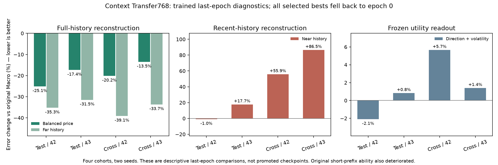

# Context Transfer768复核：完整历史有远处收益，尚未形成平衡升级

2026-10-04复核（训练完成于2026-10-03）。来源`babel_context_transfer768_reports.tar.gz`，SHA256为`e28dbc2dc7c3b3f683755979a9232b4f9633afd0b0e28e19411101356bb5ccc2`。事前协议见[BABEL_CONTEXT_TRANSFER768.md](BABEL_CONTEXT_TRANSFER768.md)，机器可读复核见[BABEL_CONTEXT_TRANSFER768_REVIEW.json](BABEL_CONTEXT_TRANSFER768_REVIEW.json)。

## 阶段决定

**本轮完整完成，但没有新模型通过保护条件，原Macro control97/94继续保留。** 补足128历史的末轮模型改善完整窗口的远处恢复，同时损伤近期恢复和旧短前缀接口；用途没有跨种子、跨集合一致提升。不能把整体重建误差下降称为通用bar表示升级。

全部预算的best都回退epoch0。它们与同种子Macro的研究用途预测和逐行重建误差完全相同；因此正式最佳模型比较没有变化。下文分析last是为定位训练实际发生了什么，不以末轮另选赢家或改变旧门槛。

本有限矩阵到此收束，不自动补轮数、降低保护线、扩层或替换交付模型。也不能推断完整历史、从头全位置训练或更大模型在原则上无效。

## 执行与公平性

| 轨迹 | 完成轮数 | 训练阶段用时 | 通过验证保护的轮数 | best |
|---|---:|---:|---:|---:|
| rolling s42 | 60 | 63.87分钟 | 0 | 0 |
| prefix s42 | 142 | 64.32分钟 | 0 | 0 |
| rolling s43 | 60 | 64.77分钟 | 0 | 0 |
| prefix s43 | 145 | 64.84分钟 | 0 | 0 |

共407个worker-epoch、15466次更新、1949123原样本曝光、9745615监督状态。两组prefix另保留第60轮update预算快照。可见训练启动至完整导出前日志16:33:19～21:55:22，约5小时22分钟；同步测量的实际训练阶段合计约4小时18分钟，其余包含验证、保存与评价，不能混为训练预算。

同一RTX3080Ti、单worker、micro8。prefix/rolling累计训练时间比为1.007092和1.001084，均在预定0.95～1.05内，没有触及300轮上限。配对原始编码器/查询头指纹和参数数量一致；全部epoch采样序列、固定LR、步数、样本数独立重算一致。前60轮同更新，扩展组同一轨迹继续，预算与验证成绩无关。

这是同步训练阶段墙钟时间匹配，含CPU供数和目标构造，不是精确FLOPs或所有阶段的相同用时。新prefix继承旧前缀监督规则，但数据池变为共同端点单视图、学习率改为固定值、优化器重置且合并裁剪；它不是旧Macro三视图课程与学习率日程的逐步原样恢复。该限制不破坏本轮两组内部对照，但限制其对“原训练能否继续”的解释。

## 末轮相对原Macro：远处改善，近期和兼容性受损

以下为相同集合、同种子、同读取方式的误差变化；负数是改善，百分比不是价格涨跌或收益率。full对每个查询端点提供完整128条特征历史；native保留原窗口内部分前缀。两接口绝对误差不直接排名，因为可读历史范围不同。

| 集合/种子 | full价格综合 | full远处 | full近期 | full历史活动 | 冻结用途综合 |
|---|---:|---:|---:|---:|---:|
| 原品种/42 | −25.12% | −35.26% | −0.97% | −14.93% | −2.10% |
| 原品种/43 | −17.36% | −31.48% | +17.71% | −5.57% | +0.83% |
| 跨品种/42 | −20.18% | −39.12% | +55.87% | −14.84% | +5.66% |
| 跨品种/43 | −13.52% | −33.66% | +86.52% | −7.84% | +1.40% |

四组full价格、远处和历史活动下降都有月级配对95%区间支持。近期原品种42变化不确定；其余三组近期误差上升有区间支持。用途没有四组一致改善，不能据单项平均降幅声称增量用途已成立；这些用途是历史状态信息读出，不是未来收益或交易成绩。

native价格综合误差分别变为原来的14.81、4.40、38.22、8.31倍；短前缀能力受损不是小幅浮动。full的近期与粗结构验证保护也全部失败，**所以即使不要求兼容旧短前缀，仍不能说部署时每根bar都看128就已经解决了问题**。

图是预定末轮的描述性比较，不是通过选择的部署权重，误差低于零表示改善。bootstrap细节和完整full/native分项保存在JSON。

## 时间对照是否改变结论

与prefix第60轮末轮相比，rolling第60轮的full综合价格误差下降约19.03%～29.64%（四队列均有配对区间支持），但它使用更多训练时间。

与已补足训练时间的prefix末轮相比：

| 集合/种子 | rolling的full价格误差变化 | 月级区间判断 |
|---|---:|---|
| 原品种/42 | −17.39% | 支持改善 |
| 原品种/43 | +0.90% | 不确定 |
| 跨品种/42 | −14.92% | 支持改善 |
| 跨品种/43 | −1.90% | 不确定 |

因此额外算力不是全部收益的解释，但也没有跨种子一致的时间效率优势。两组都存在未守住原近期能力的问题，不能把一个受损对照上的优势当成主模型升级。

正式336项检查中312项保留条件通过，24项增益条件未过；**312通过主要因为best回退后与原模型相同，不代表312项训练进步**。历史重建进展和表示升级的正式决定均为false，保持不变。

## 为什么暂时不补训练

四条轨迹每一轮都未满足保护条件，包括普通prefix对照。第1轮full综合价格即增加约53%～346%，后续逐步恢复；rolling的native退化持续到末轮。这与训练分布/位置职责切换及迁移稳定性问题相符，但没有隔离编码器、解码器、学习率重启和采样变化各自的作用，不能直接断言唯一原因。

训练末20轮loss仍下降约3.15%～16.98%，full价格选模分数也下降约3.68%～20.59%；有限续训未证明收敛。然而总体loss下降并未消除近期与旧接口退化，不能用“还在降”作为无限延长同配方的依据。

下一项核心改动前，优先厘清迁移稳定性：以原训练契约的稳定恢复为参照，区分学习率/优化器重启、采样切换和完整历史职责变化。已有零训练核对确认目标没有明显换坐标错误；仍不能用此证明真实优化器更新和梯度行为没有问题。要先设计有限、能定位原因的对照，不重复大矩阵，也不先改架构或加复杂头。

## 复核范围与边界

- 当前完成清单62文件中38项实际导出并通过SHA256；24项未导出：16个神经模型/恢复PT、8个输入/状态NPZ。不能声称本地重放过全部神经前向、优化器或读取器拟合。
- 106源码哈希匹配；Macro来源131份可用报告、Uniform来源17份绑定文件核验。模型选择、读取器、输入与状态缓存索引的绑定核对一致。
- 独立重算407轮采样/更新/LR/预算停止和验证选模；221个用途头、1105个alpha候选的已记录验证选择一致。没有重新拟合缺失状态缓存。
- 从314483个用途预测值、956256个逐行历史误差重算8074个数字、分组及336门槛，最大差异0。
- 本地1251原始CSV哈希一致；重新验证255条同合约/同分区资格：train4789、val978、test984、cross439，跨品种14端点剔除。18499个研究用途目标和mask从原始数据复算，最大差异8.88e−16。
- 两研究集固定各3例、4位置的full/native历史目标从原始数据重建，最大差异3.55e−15；与旧ordered-targets→normalize→query管线native目标的最大差异5.37e−7，mask完全相同。这是6例坐标/目标检查，不是全量标签或神经权重回放。
- 研究集多次使用，不冒称独立新留出；月级区间是配对诊断，不消除反复研究选择的影响。本次本地0神经训练、0优化器更新。

## 计划分支仍保留

1. 当前主线：旧Macro表示与原查询接口继续作研究基准，当前续训矩阵结束。
2. 从头全128位置同权训练尚未由本轮覆盖；不把warm-start失败外推为这个假设失败。
3. 跨分辨率共同物理历史仍保留，已有失败配方不自动重开。
4. 每收到真实新bar后刷新编码并做一步预测，与无新行情的自由状态外推分别登记。
5. 旧H4确定性自由外推未产生价格增益，结论不改；本轮历史重建收益不构成重开预测大矩阵的证据。

本次完成结果复核与阶段归档，没有发布新AutoDL训练命令。
