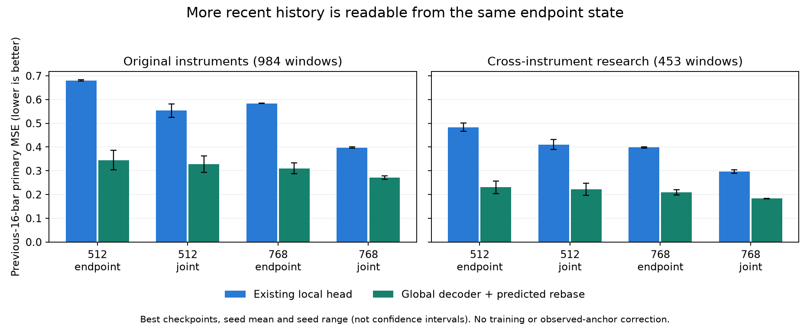

# 冻结末端读出复核：近期信息可读，原局部头未充分利用

结论：同一个h128经现有全局PCA解码器、使用自身预测锚点截取近期历史，稳定优于原局部头。末端读取差不能解释为近期信息完全不在向量中。本轮没有更新模型，也没有消除上一轮全局路径保留失败；统一逐bar表示和完整重建精度仍未完成。结束本次读出诊断，下一步应固化可用接口，而非增加训练矩阵。

## 来源与核验

归档`babel_endpoint_readout_reports.tar.gz`，SHA256 `2d51595b99dac20258b1694c5518a270acd2071bc0508dc695413a91e7be61c7`。实现0e402eb；all退出0、complete、source_unchanged=true；编码器更新、读出头更新、统计拟合均为0，automatic_promotion=false。日志21:50:19–21:52:01，约1分42秒。

- 16个既有检查点全部保留：八组模型的best/last，未按本次结果重新选择种子或epoch。当前152项文件指纹、上游bar_alignment归档53项可用引用一致；16项源权重引用按协议未附带。
- manifest源码、来源身份、原晋升失败决策匹配；16组原验证重放记录一致。两研究集的原p128读出共192个逐窗口指标数组复现，全局报告各分项亦复现。
- 重算384项均值、192项配对指标及5088个分组，结果一致。固定样例的1536个逐样例指标值重算通过。
- 对64个best固定样例，直接使用上一轮归档的完整全局预测，取零索引111:127并减去自身预测的110位置收盘，复现本次裁切输出；真值同位置重新锚定亦一致。没有利用真实收盘锚点校正模型预测，也没有增加输入信息。
- 16个已训练检查点各35项因果/独立调用检查，共560项，均直接通过预设FP32容差。最大绝对差1.812e-5，最大逐元素容差占比约0.101，没有触发FP64复查或放宽阈值。每检查点固定8个验证窗口，覆盖严格前缀、修改/追加未来、独立调用和批次独立性；这是固定样本检查，不是所有输入上的形式化证明。
- 128上下文与重置64上下文的差异只是语义诊断，不要求相等，不声称支持跨窗口KV复用或全历史递推等价。来源无权重/完整原数组，本地没有真实神经推理或训练；核验范围为归档一致性、数值统计、样例和AutoDL执行记录。

## 同一向量，换用现有路径后明显改善

以下为best两个种子的均值，目标是当前第128根之前的第112–127根历史，七通道、原局部尺度、三族等权综合MSE。不是未来预测。

| 方案 | 原品种：局部头→全局截取 | 改善 | 跨品种：局部头→全局截取 | 改善 |
|---|---:|---:|---:|---:|
|512 endpoint|0.680530→0.344625|49.36%|0.483407→0.230524|52.31%|
|512 joint|0.554019→0.327710|40.85%|0.410888→0.221752|46.03%|
|768 endpoint|0.584174→0.310024|46.93%|0.398565→0.209508|47.43%|
|768 joint|0.397946→0.271646|31.74%|0.296462→0.183149|38.22%|

误差棒表示两种子范围，不是置信区间。改善不是某一个平均分掩盖分项失败：16检查点×两研究集的32组对比中，primary/path/body/activity/change1/closeMAE共192项全样本配对周区间上界均小于0。各品种/周期/月分组仍完整保留，不把全样本结论扩展成每个小分组都通过。区间未经多重比较校正，研究集已反复使用，仍不作为新独立泛化证明。

## 已定位与尚未解决的部分

有证据支持：原局部头并不是末端信息量的可靠上限。换成已有全局解码路径，无须更新h128，就可以恢复更多近期价格、实体及量仓信息。当前全局解码是固定仿射PCA映射，裁切和预测锚点相减也是仿射变换；忽略浮点舍入时，两者可合成为固定局部投影。这条路线不需要训练新网络。将来若合并计算，仍需核验与当前分步实现的数值等价，不能直接宣称位级完全相同。

不能据此断言：全部近期信息已经无损保留；此前的末端监督失衡是唯一根因；原局部头经过其他训练也一定无法改善；768已取得正式替换资格。

以768_joint为例，两种子best均值：

| 指标 | 原品种：局部头→全局截取 | 跨品种：局部头→全局截取 |
|---|---:|---:|
|近期收盘MAE|21.18→16.86 bp|15.98→11.75 bp|
|一步变化相关性|0.624→0.743|0.570→0.731|
|一步变化标准差比|0.672→0.735|0.718→0.746|

近期实体通道R²约0.478/0.477，仍有明显未恢复变化；持仓相关通道也未达到高保真。新的末端综合误差0.272/0.183，仍高于此前保留中间位置局部头的0.035/0.008。位置、目标片段分布不同，这不是严格等难度容量对照，但不能因此宣称最新状态已达到中间位置水平。剩余误差尚不能仅凭两条固定读出区分为编码压缩、训练利用或读出限制。

上一轮768_joint某种子的全局路径误差增加13.9%/15.4%，本轮未修改它；原`retain_baseline_and_stop`决策原样保留。本轮更好的局部读出不是放宽全局保留门槛的理由。

## 阶段收束与固定接口建议

保留512_endpoint作为阶段基线，两个种子的联合模型继续作为研究候选，不自动晋升。停止扩维、扩层、损失权重和新读出训练搜索；本轮诊断问题已经得到回答，不为同一结论再安排一轮训练。

下一步建议固化现有模型的窗口状态接口，明确返回：窗口结束时间、来源/配置、末端embedding、全窗口历史重建、由现有全局输出得到的近期16根重建。近期读出采用本轮验证的自预测锚点裁切，不再把原局部头作为h128唯一质量依据；可先保留分步计算，避免引入未经验证的算子融合差异。

若需要为每根bar提供状态，应将其定义为“截至该bar的滚动128根窗口末端h128”，继承原合约边界、因果特征及预热要求，缺少足够有效历史时明确未就绪。不能直接把单个窗口内h32/h64/h128这些训练角色不同的中间状态宣称为已统一的逐bar接口；也不能为弥补精度改用未来窗口或较早状态冒充当前状态。滚动窗口会增加计算量，不承诺现成流式缓存等价，也不等于模型使用了全部历史。

这是把已验证的因果窗口表示变成可调用、可审计的阶段产物，不是宣布原始通用表示目标完成，更不是预测/交易能力证明。本次只复核和记录接口建议，尚未实现该接口或启动后续实验。
