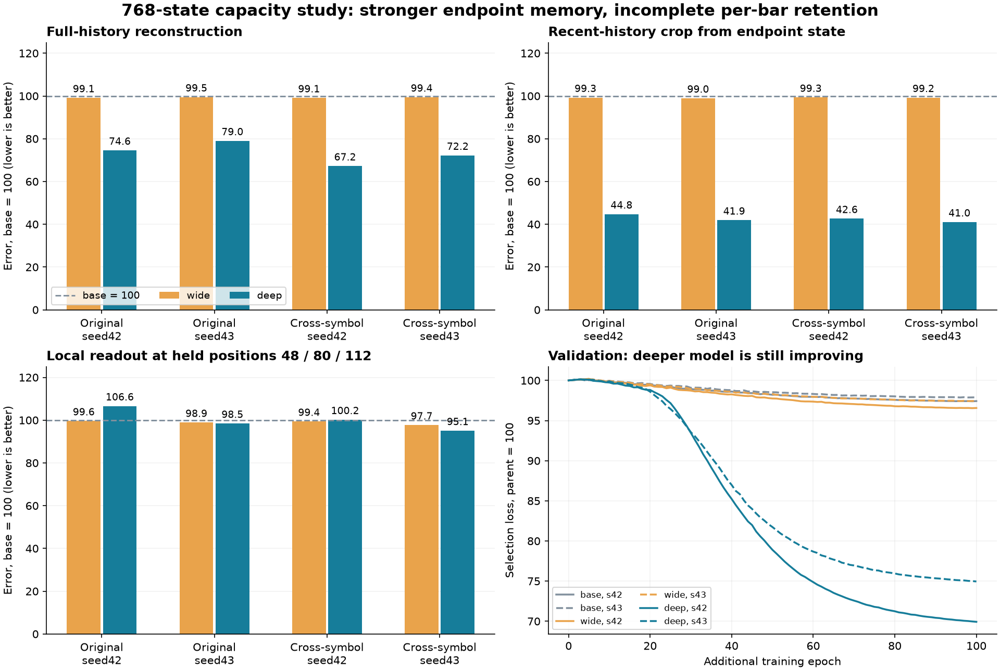

# 固定768状态扩容复核：深度带来明显重建收益，完整保留尚未通过

2026-09-25。报告：`babel_growth768_reports.tar.gz`。协议见 [BABEL_GROWTH768.md](BABEL_GROWTH768.md)，数值复核记录见 [BABEL_GROWTH768_REVIEW_AUDIT.json](BABEL_GROWTH768_REVIEW_AUDIT.json)。

## 阶段结论

四层、FFN3072、8头在同样768维输出和固定解码器下，明显改善了历史重建及共同历史回读稳定性；不是只能靠增大embedding维数才能获得收益。两层仅加宽FFN收益不到1%，未达到预定5%门槛。本次结构归因是：在FFN3072条件下由两层增至四层有效；没有测试四层FFN512，不能声称已经证明所有增益只来自层数或得到最优结构。

正式判定仍为 **no_capacity_upgrade**：1536项检查中1502项通过、34项失败，不能按通过率修改原来要求全部保留的协议。其中8项是wide未达到5%重建增益，另26项是deep的局部回读与用途置信界保留未通过。部分检查重复同一父模型或相同best/last，不是1536份独立证据。

保留两份deep作为本轮最强重建研究候选，保留原400轮一致性模型及读出作为能力参照；尚不替换原交付版本。不能因完整升级未过就写成“加深无效”，也不能因重建改善就宣称每根bar的通用表示已经完成。

## 运行、预算与来源

- 全部六组完成100轮，各478900对、957800视图、3800次encoder/head更新。同种子的三组每轮样本、位移、前缀计划哈希一致；均从对应一致性400轮开始，统一重置AdamW并使用同样预热/余弦学习率。
- base/wide：seed42选99轮、seed43选98轮；deep两种子均选100轮。因此best/last不是从研究集择优；deep最佳在预算末端。
- 完整验证选模、12份检查点和156个读出头锁定，780个闭式候选；初始功能保持、训练后因果检查及固定解码器检查通过。
- 原训练4789、验证978、研究984/453；共同历史研究984/443。36,106合格训练池没有变更。研究集仍是反复使用的数据，并非最终独立确认。
- 运行约2小时33秒（7233.37秒），两个并行worker。编码器参数base 6,919,936、wide 14,789,376、deep 28,965,120；共享局部头均225,648参数。单worker峰值已分配显存约1.31/2.15/3.96 GiB；不等于nvidia-smi总占用，且不同并行重叠导致单worker耗时不能直接作纯速度比较。
- 本地校验48份代码哈希、91次导出文件哈希，重算历史预算/选模/抽样、预测对应13目标误差、完整1536条判据和原用途协议，均与报告一致。模型权重、缓存和读出矩阵未包含在报告包中，没有在本地重新验证其二进制内容或执行真实模型推理、训练、拟合。前述权重/因果证据来自已绑定的远端报告。

## 与同预算base相比

下表都是误差变化，负数更好。best为主要结果；正式判定同时要求last。近期回读指从末端向量的全局重建裁出最近历史，不是中途bar的共享局部解码器。

| 研究集 / 种子 | wide全局 | deep全局 | deep近期回读 | deep中途局部回读 | deep历史用途 |
|---|---:|---:|---:|---:|---:|
| 原品种 / 42 | -0.88% | -25.40% | -55.25% | +6.61% | -0.89% |
| 原品种 / 43 | -0.50% | -20.95% | -58.07% | -1.55% | -0.31% |
| 跨品种 / 42 | -0.91% | -32.77% | -57.37% | +0.21% | -0.44% |
| 跨品种 / 43 | -0.57% | -27.80% | -58.96% | -4.93% | +2.05% |

deep相对相同FFN的wide，全局误差下降20.56%～32.16%，两种子/两研究集/best和last的至少5%收益判据全部通过。增量不是仅有末端当前bar复制：全局重建主指标排除当前bar，实体、活动和逐根变化误差均降低。全局change1下降19.47%～37.62%，而价格路径误差下降4.91%～9.69%、收盘价MAE下降2.68%～6.68%；不能把综合误差下降25%描述成价格误差统一下降25%。

共同历史combined_gap：shift1下降23.32%～30.92%，shift16下降31.29%～39.05%，未训练位移shift64下降40.43%～53.68%；共同历史真实误差、原锚点MAE等保护项全部通过，未发现以共同变坏来换稳定的判据失败。

## 为什么还不能完整升级

**中途bar局部回读有实际代价。** seed42原品种，在训练未使用的48/80/112前缀位置，用该bar状态回读此前16根的综合误差相对base增加6.61%，相对wide增加6.99%；超过5%保护线，周置信区间也未通过。相对旧父模型均值增加4.15%，但置信上界仍不满足5%保留。分解到p48为+7.47%、p80为+11.41%、p112为+0.91%；综合局部实体误差+8.61%，路径+1.74%，活动+1.41%。这是定位结果，不能把这三个留出位置改成训练位置去修考试答案。

**用途失败主要是保留证据不够稳定，而非平均分大幅崩溃。** deep主用途均值相对base为-0.89%/-0.31%/-0.44%/+2.05%，但原品种的周级保留区间仍有上界超过预设界限。seed42原品种方向误差+4.65%，波动均值-2.07%；波动收益中2026-02-02交易周贡献较大，而多个其他周退化，不能只看总体平均，也不能删除该周重写正式分数。seed43有一项utility相对base的置信上界仅略高于0，仍按原协议判失败；没有事后放宽阈值。

当前bar七字段的24个模型/数据集组合均通过，deep最低单字段R²约0.976；它只证明当前信息保留。全部12份检查点的原raw/PCA/current完整历史用途协议仍未通过。历史用途的线性读出已重新校准，不能再把这部分失败直接归咎于使用旧读出头。

## 收敛与后续主线

deep两种子最后20轮验证选模值仍下降约1.65%/1.16%，最佳均在100轮；不能说训练已充分收敛。但这也不证明只追加轮数就会修复中途bar局部回读或用途保留。维持本轮预定预算结论，不自动延长、扩头数或加到6/8层。

下一步建议固定四层结构，围绕“末端更强是否覆盖到中途bar状态”做一次有明确终点的检查：冻结base/deep编码器，在原训练前缀上同预算重新适配同规格共享局部解码器，保留48/80/112位置及原研究集作为评价，区分局部解码接口适配与状态本身的信息缺口。两个种子、相同初始读出/优化机会，并保留当前配套头参照。该检查尚未实现或运行；不会自动改变本轮正式判定，若仍失败再考虑编码器局部历史约束，不能把冻结读出任务无限扩展。

历史用途的周级不稳定已经利用现有预测做了分解，不追加Ridge/目标网格，不训练分类规则来刷分。用户目标仍是每根已收盘bar的因果行情压缩表示；重建、局部回读和用途读出是证据，不是预测盈利能力。
