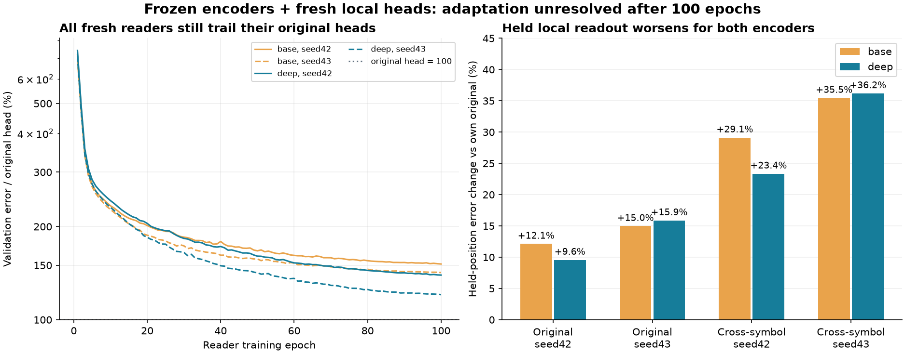

# 局部读出适配复核：随机新头未恢复，不能定位为编码器信息损失

2026-09-25。报告`babel_local_readapt768_reports.tar.gz`；原协议见[BABEL_LOCAL_READAPT768.md](BABEL_LOCAL_READAPT768.md)，复算摘要见[BABEL_LOCAL_READAPT768_REVIEW_AUDIT.json](BABEL_LOCAL_READAPT768_REVIEW_AUDIT.json)。

## 结论

四组均正常完成，正式结果`local_readout_retention_unresolved`。120条保留检查中36条通过：对同预算base新头为36/40，对原base/deep局部头为0/80。best均为100轮且等于last，部分检查重复同一份权重，不能当作独立证据或按通过率晋升。

本轮没有修复中途bar的局部回读，也没有完成“旧头适配不足还是编码器信息缺失”的因果定位。随机新头不仅在deep上退化，在base上也没有追上既有旧头；失败不是四层独有。相同冻结状态已有旧头能取得更低误差，因此不能把新头额外误差解释成该状态必然缺少这些信息。

保留growth768四层编码器及原配套局部头作为更强重建研究候选，原两层及旧400轮一致性版本继续作参照。本轮四个随机新头不替换原头；上轮`no_capacity_upgrade`和历史用途保留未通过的结论均不改。

## 执行及核验范围

- 全流程344.47秒，约5分44秒。四组100轮，各478900窗口曝光、1915600局部目标曝光、3800次局部头更新，全部选第100轮。小头训练主体每组约18～19秒，编码器状态预缓存，整体耗时还包括状态提取、哈希校验及评价；不是3800次编码器训练。
- 同种子base/deep初始头权重签名一致，每轮窗口顺序及四个前缀计划一致。原4789训练/978验证/984原品种研究/453跨品种研究身份未变。
- 训练状态缓存94个非留出位置，验证只用32/64/96/128；48/80/112不参与训练、状态统计或选模。验证选择、曝光数及学习率安排核验通过。
- 四个编码器的原验证/因果检查正常；八个模型×研究集原局部头回放通过，其报告与上一轮growth768对应结果相符。两研究集记录的冻结模型签名逐模型一致，来源能力证书及原用途判定一致。
- 本地检查50份源码哈希、69次本轮导出文件哈希、79份可得前轮文件哈希，逐窗口误差汇总与完整120条周级判据复算一致。跨系统libm计算余弦LR有最高1.0842e-19的末位差异，本地以1e-14相对容差复核；不是远端学习率配置变更。旧绑定代码未修改。
- 报告按约定不包含.pt/.npy/.npz，本地没有重跑真实模型或检查缺失二进制内容。冻结、更新次数和初始化的运行证据来自已校验报告；不把报表回算当作重新执行CUDA验证。

## 新头与各自原头相比

以下是留出位置48/80/112的综合误差变化，正数更差。新best/last完全相同。

| 研究集 / 种子 | 两层新头相对原两层头 | 四层新头相对原四层头 | 四层新头相对两层新头 |
|---|---:|---:|---:|
| 原品种 / 42 | +12.13% | +9.56% | +4.17% |
| 原品种 / 43 | +14.97% | +15.88% | -0.77% |
| 跨品种 / 42 | +29.12% | +23.36% | -4.27% |
| 跨品种 / 43 | +35.45% | +36.19% | -4.42% |

在用于训练/验证的位置32/64/96/128，研究误差相对原头也退化：base +37.91%～44.71%，deep +19.26%～34.13%。不是仅留出位置插值失败；新头连已有位置对应的研究表现也尚未恢复。

四层新头在训练位置综合误差上比两层新头低8.61%～15.48%；在留出位置四个均值中三个更低，一个高4.17%。这只能说明本轮统一新读出条件下四层没有普遍劣于两层，不能因而覆盖对原头的明显代价或宣布恢复。原品种seed42仍有留出primary/body相对新base的周置信区间保留失败。

## 预算、公平性与解释限制

四个新头之间的规格、初始随机参数、曝光和更新机会相同，比较公平。但新头与长期联合训练过的原头有不同的学习历史：本轮重新随机初始化、加入训练状态标准化、只使用固定4789训练窗口，并采用新的局部单任务优化；上轮编码器阶段使用更大配对资格池，原头还继承更早阶段的训练。因此不能把“同规格新头100轮不如旧头”单独归因于层数或embedding信息丢失。

全部新头的验证最佳都在第100轮；最后20轮base验证误差仍下降1.82%～2.13%，deep约3.17%。这排除了“已经确认充分收敛”的说法，但不能证明单纯追加轮数必然恢复。训练SmoothL1与验证MSE的采样/度量不同，也不能直接以二者数值之比宣称过拟合。

本轮最初希望区分局部接口适配和状态信息缺口；当前结果的诊断力不足，需要明确承认这一点。代码完成和预算相同并不等于负结果可以回答全部研究问题。保留原定`unresolved`，不改阈值，不删除失败项，不宣布深度方向失败。

## 收束及下一步建议

结束本轮随机重训配置，不自动延长、加层或新增头宽/学习率网格。四层编码器及其原头、全局解码器、原历史用途读出均保持原版本；上轮全局重建和重叠稳定性收益没有因本轮而被覆盖。

若继续定位，优先从每个模型各自的原局部头开始冻结编码器适配，保留原函数为epoch0回退；先验证原头在新入口上的函数与验证分数复现，再进行事前限定的同预算局部优化。需要明确披露两组初始头不同但有相同上游训练预算，不再把“必须随机同权重”当作所有适配问题的公平定义。训练覆盖、归一化和学习率应单独锁定，避免同时变动后继续把失败归咎于编码器。这只是下一步建议，尚未实现或启动。

不新增方向/波动规则任务来追逐分数。总目标仍是每根bar的因果历史状态表示；当前更强的是四层末端历史重建，中途状态可读性和完整用途保留仍需分别论证。
