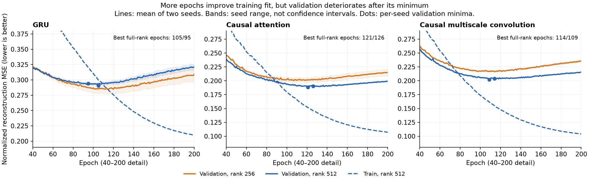

# 原生512维与解码通路容量报告复核

## 结论与决策

512维通路对本轮attention与多尺度卷积的综合历史重建有两种子、两研究集一致的改善证据；GRU没有受益。attention_r512是本轮综合指标最好的配置族，但没有全面替换旧attention或既有长短状态主模型的证据。

这轮回答了容量约束的局部问题：256维通路确实限制了部分配置，但放宽通路没有解决主要的历史信息保留差距。不要直接续训到更多轮，也不要因综合分数改善而忽略价格退化。先定位编码、读出和泛化的限制，再决定下一轮正式训练。

## 来源与核验范围

- 用户报告：`babel_capacity512_reports.tar.gz`，SHA256 `ae6f519c98bdf613422cb430ab3db6ddbfc0f69b94ebfe2896a54365c1f2213f`，93个归档成员。
- 训练源码与本地29997e3提交对应；manifest内全部Python源码指纹一致。原architecture源码和来源报告指纹保持一致。
- `command_exit_code=0`、根完成记录及12组完成记录均为complete；每组200轮，每轮4789个训练窗口、38次更新，共每组7600次、全矩阵91200次更新。
- train4789、val978、test984、cross_research453；batch128、micro64、FP32、关闭TF32、共同lr3e-4，2个worker并行，RTX3080Ti/PyTorch2.8.0+cu128。
- 日志从13:19:24至15:21:32，约2小时2分8秒。平均epoch计算时间GRU6.06s、attention5.88s、卷积5.73s；不包含全部checkpoint I/O。单worker训练峰值分配显存约779/860/1009MiB，不是整卡总占用。
- 复核39个本轮报告文件指纹、27个原报告文件指纹、3个源缓存元数据指纹。检查12份完整历史、学习率、更新数、报告中的最优epoch/验证分数与选择锁一致。
- 从逐窗口误差重算340个指标均值、综合损失权重及变化指标聚合；重算360个指标配对比较、9540个分组区间；另外复核84个旧模型/PCA256配对比较。新报告PCA512逐窗口误差与旧报告复现一致。
- 归档按约定不含24份best/last权重、缓存数组和PCA二进制。本地核对了它们记录的指纹关系，但没有重新运行真实权重推理或重新计算PCA系数，也不能独立复验未导出的epoch0权重。不能把报告一致性复核称为全量原始数据复现。

## 容量对照

以下为两个种子的综合标准化MSE均值，越低越好。百分比是两个种子均值之比，不是显著性判断。

| 编码器 | test rank256 | test rank512 | 相对变化 | cross rank256 | cross rank512 | 相对变化 |
|---|---:|---:|---:|---:|---:|---:|
| GRU | 0.432380 | 0.440141 | +1.79% | 0.281604 | 0.290596 | +3.19% |
| Attention | 0.320209 | 0.308280 | −3.73% | 0.202924 | 0.189535 | −6.60% |
| 多尺度卷积 | 0.339499 | 0.323759 | −4.64% | 0.219977 | 0.204871 | −6.87% |

Attention rank512减rank256的综合误差周配对区间：

| 研究集 | 种子 | 均值差 | 区间 |
|---|---:|---:|---|
| test | 42 | −0.011762 | [−0.017794, −0.007006] |
| test | 43 | −0.012097 | [−0.016073, −0.008611] |
| cross_research | 42 | −0.009294 | [−0.012088, −0.006759] |
| cross_research | 43 | −0.017483 | [−0.019683, −0.015238] |

卷积的四个综合区间也都低于零；GRU三个区间显示退化，test/seed43跨零。不能推断GRU永久不适合512维，结论限于本轮参数化、共同LR及预算。

保留检查必须单列：

- Attention：test/seed43实体误差增加0.023752，区间[0.005851,0.043304]；cross/seed42路径误差增加0.000661，区间[0.000006,0.001532]，后者接近零边界。这是探索性、未经多重比较校正的退化证据，不能说所有目标均受益。
- 卷积：没有目标族总体区间显示明确退化，但test路径MSE两种子点估计均变差；未显著不等于保留等效。
- 本轮attention_r512相对gru_r512、多尺度r512的综合误差在两种子/两集均有改善区间；对卷积的test实体误差却更差。因此它是综合指标优先候选，不是全部目标最优。

六种配置初始记忆入口数值秩符合256/512，因果前缀最大差为0。12个选中模型的入口数值秩也符合预设；attention_r512的入口映射最小奇异值约0.507/0.491。此检查只针对端点到两token展平记忆的线性通路，不证明状态分布有效秩、解码输出Jacobian秩或512个有用信息方向。

## PCA补评：入口容量不是全部解释

| 表示/模型 | test综合MSE | cross综合MSE |
|---|---:|---:|
| PCA256 | 0.164310 | 0.099518 |
| PCA512 | 0.040667 | 0.016723 |
| 新Attention rank512，种子均值 | 0.308280 | 0.189535 |

即便PCA只有256个坐标，综合误差仍约为新attention的一半。这表明这些已观察历史目标存在更紧凑的编码方式；不能继续把差距全部归因于状态维数不足。

PCA直接接收由已观察输入解析构造的目标序列，且使用线性平方误差基底；神经编码器从28维bar特征学习组合与压缩，训练损失为SmoothL1，选模才用综合MSE。两者输入处理和优化问题不相同，因此不能凭PCA优势直接判定某个神经模块有bug，也不能断言网络应该轻易达到相同分数。

PCA优势也不是逐项全胜。新attention在cross的路径/多尺度变化误差和收盘MAE优于PCA256；PCA256的实体、量仓历史保留明显更好。新attention的单bar变化相关性test约0.499–0.505、cross约0.542–0.562；PCA512约0.844/0.827。当前仍未达到高保真保留全部局部细节的目标。

## 不能用新综合分数掩盖旧价格优势

以下新旧比较使用同样缓存、目标和统计量，只有背景比较含义；新旧编码器深度、末端归一化和解码器同时变化，不能归因于容量单项。下列新增周区间是本次事后探索，不参与选模或新的确认性门槛。

| 指标，种子均值 | 旧Attention test | 新Attention r512 test | 旧Attention cross | 新Attention r512 cross |
|---|---:|---:|---:|---:|
| 综合MSE | 0.311294 | 0.308280 | 0.202804 | 0.189535 |
| 路径MSE | 0.048339 | 0.061990 | 0.006055 | 0.008137 |
| 活动MSE | 0.436738 | 0.400444 | 0.493970 | 0.451889 |
| 收盘MAE，bp | 28.7293 | 32.5780 | 17.9704 | 19.6718 |

新模型量仓误差减少约8.3%/8.5%，但收盘MAE增加13.4%/9.5%。四个新旧收盘MAE周区间均高于零；test综合改善的两区间跨零，cross两区间低于零。主收益偏向量仓保留，价格表达有代价。

本次附加尾部诊断：新attention test中路径误差最大的9个窗口（984个中的不到1%）贡献了约72%/75%的路径MSE，cross前4个约40%/41%。最高窗口分别为ag/60/SHFE.ag2606，2026-02-11 14:00，以及au/60/SHFE.au2606，2026-02-25 00:00。这里只定位误差集中，不认定原始行情错误，也不删除窗口或用截尾分数替代原指标；后续应检查对应原始窗口及目标构造。MAE也变差，价格退化不能只用MSE尾部敏感性搪塞。

## 训练曲线：不建议直接续训

| 编码器/容量 | seed42最优epoch | seed43最优epoch |
|---|---:|---:|
| GRU256 | 115 | 102 |
| GRU512 | 105 | 95 |
| Attention256 | 131 | 107 |
| Attention512 | 121 | 126 |
| 卷积256 | 104 | 117 |
| 卷积512 | 114 | 109 |

所有组最优epoch在95–131，均非epoch0或预算末尾。后续训练误差下降、验证误差持续回升，有明显过拟合迹象。第200轮验证综合误差比各组最优高约5.3%–10.6%。attention_r512固定末轮在test较选中模型差约6.7%–8.1%，cross差3.0%–3.7%。不能把训练loss仍下降当作延长本轮预算的依据。

图为两种子均值，阴影为种子范围而非置信区间；显示40–200轮局部。训练MSE是每轮更新过程中的平均值，验证MSE是轮末固定权重评价，两者不是完全相同的离线训练/验证重评协议。

## 后续优先级

1. 保留旧attention价格候选、新attention_r512价量候选及本轮所有记录；既有长期/短期主模型不自动替换。停止本配置的盲目续训和再次扩大三架构矩阵。
2. 优先做冻结状态的有序历史读出：在原训练集拟合线性ridge和小型非线性读出，仅原验证集选正则/epoch；同时保留原头、两个种子、两研究集、目标族和固定历史位置评价。新头可改善说明既有状态仍有可读取信息；不能改善也不能证明信息绝不存在。
3. 同批做已知可压缩输入的解码校准：用训练集PCA512系数接入同款解码器，以固定PCA逆变换作为明确参照，仍只在训练/验证上拟合/选择。它用于检查读取结构和优化是否能保留已知信息，绝不作为预测模型，也不把更容易的输入任务与原端到端任务混为一谈。
4. 并行回查上述极端窗口，保持原指标完整。确认读取限制后，再决定改善解码器，还是扩大原训练分区的样本覆盖并做预算控制；本轮只有4789个训练窗口，不应直接套用“大模型只需更多轮”的判断。

以上是下阶段建议，尚未启动新的训练，也不预先写入成功结论。
