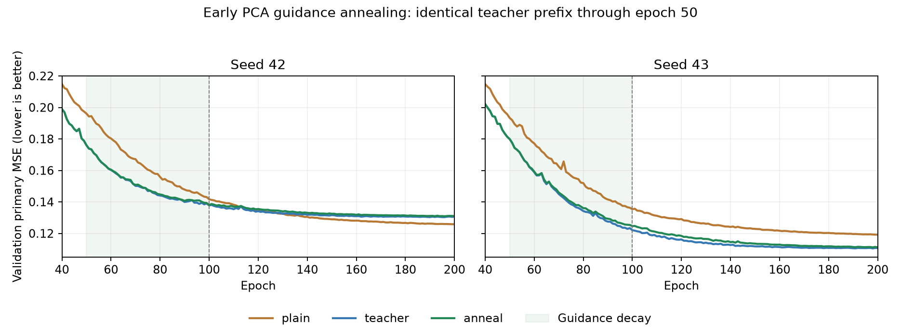

# PCA教师早期退火：报告复核

## 阶段结论

本轮完整执行了预声明的早期退火，但没有通过跨种子、跨研究集的综合改善和分项保留门槛。相对plain固定PCA解码基线，seed42两集退化、seed43两集改善；不能挑seed43或用均值掩盖失败。维持plain作为下一阶段研究基线，不自动替换既有主模型；按原停止规则结束本轮教师权重/残差组合搜索。

退火相对constant-teacher四组价格路径、变化和收盘MAE均改善，同时四组量仓误差均退化。它在本配置下主要改变了目标间的取舍，并未提供稳定全面收益。这不是对所有教师学习方法的否定，也不能唯一归因于某种优化机制。

## 完成情况和复核范围

- 归档：babel_pca_anneal512_reports.tar.gz，56成员，SHA256 `23a52c86323d65e75693644cb7df57f56a2a84a400866e6df1cf450a30e76469`。
- 源码指纹对应23a12b5；退出码0，两个新组均完整200轮。每轮4789窗口、38更新；每组7600步，合计15200步。旧四组只读复用，没有增加预训练或混入300轮分支。
- RTX3080Ti，Torch2.8.0+cu128、NumPy2.3.2，batch128/micro64，两worker。日志01:51:42至02:05:39，13分57秒；每组记录训练约777秒，峰值分配显存549088256字节（约524MiB），非整卡总占用。
- 核验17根报告指纹、22旧来源报告指纹、12份复制控制文件、1坐标统计指纹、6份新worker报告指纹及选模锁。四个旧对照和两个PCA参考的120项逐窗口误差数组在预声明容差内复现，8份旧对照末轮主/分项指标复现。
- 重算160指标均值、48项配对指标及1272个分组区间；验证primary权重和1/4/16/32跨度聚合。研究集inventory保持test984/cross453。
- 两个新组前50轮的训练/验证各指标与同种子constant-teacher逐项完全一致，之后才随着λ日程分岔。新组epoch0验证复现，学习率/λ/样本曝光/更新步数/选模一致。跨平台复算cosine LR有约1e-20量级末位差异，按严格浮点容差核对；训练主机内的历史检查已通过。
- 归档不含4个新best/last、8个旧控制best/last、原始缓存/PCA和两份坐标数组。本地核验报告及指纹关系，没有重跑真实权重推理，也没有直接读取训练优化器二进制；连续优化器由已匹配源码流程保证，不能把报告复核写成重新检查过二进制动量。

## 同200轮结果

以下均为验证选中的检查点，综合标准化MSE越低越好：

| seed | 方案 | test | cross_research |
|---|---|---:|---:|
|42|plain|0.232099|0.125300|
|42|constant-teacher|0.244158|0.129432|
|42|early-anneal|0.242555|0.130291|
|43|plain|0.233131|0.120729|
|43|constant-teacher|0.227019|0.109612|
|43|early-anneal|0.223742|0.110836|

anneal减plain的周配对区间：

| 集合 | seed | 综合差值 | 区间 | 相对误差变化 |
|---|---:|---:|---|---:|
|test|42|+0.010455|[+0.006883,+0.014193]|+4.50%|
|test|43|−0.009390|[−0.012125,−0.007078]|−4.03%|
|cross|42|+0.004991|[+0.003478,+0.006718]|+3.98%|
|cross|43|−0.009892|[−0.012270,−0.007968]|−8.19%|

这些是反复使用研究集上的未校正探索区间，不是两个种子的总体置信区间，不能将跨窗口统计支持扩展为任意初始化都成立。

两个种子的均值：

| 方案 | test综合 | cross综合 | test收盘MAE/bp | cross收盘MAE/bp |
|---|---:|---:|---:|---:|
|plain|0.232615|0.123014|33.6709|19.8498|
|constant-teacher|0.235589|0.119522|36.7389|22.4665|
|early-anneal|0.233148|0.120564|34.7061|20.8581|

与plain相比，均值test综合+0.23%、cross−1.99%，但收盘MAE+3.07%/+5.08%，多尺度变化误差+2.70%/+2.77%。seed42在test的变化、实体、收盘MAE退化有区间支持；cross的路径、变化、实体、量仓及收盘MAE均有支持。seed43在test实体/量仓改善，cross变化/实体/量仓改善；其收盘MAE没有明确改善证据。

单bar变化相关性也延续种子分歧：plain在test为0.640/0.649，anneal为0.616/0.661；cross从0.673/0.690变为0.648/0.705。不能将seed43的0.705代表整套方案。

与constant-teacher相比，anneal的价格路径、多尺度变化和收盘MAE四组区间均支持改善；量仓四组均支持退化。收盘MAE均值降低5.53%/7.16%，量仓误差增加3.54%/5.35%。test综合两种子均改善，但cross综合两种子均退化。

## 释放是否真的完成，末轮是否改变结论

| seed | 最优epoch | 选中λ | 最优val | 第200轮val | train第200轮 |
|---|---:|---:|---:|---:|---:|
|42|196|0|0.130900|0.131035|0.062102|
|43|198|0|0.111164|0.111231|0.056093|

第100轮λ归零，第101–200轮继续无辅助监督训练。本次两个选中模型确实完全退出了坐标监督，不存在上轮晚期release选中时仍保留λ的问题，也没有epoch0回退。

固定第200轮test综合为0.242713/0.223760，cross为0.130329/0.110921，仍是42差于plain、43优于plain。结论不是最佳轮次选择造成的假象。

末25轮验证改善约0.29%/0.69%，最佳位于预算末段。没有充分收敛证明，也不凭末段改善小就宣称方向无效；本次决策是当前同预算配置未通过预声明门槛，不因某个研究结果更好而继续追加教师调参。

## 极端路径审计

两端点均matched：原始CSV、缓存几何特征和训练价格目标一致，缓存自身目标重算也通过。AutoDL的CSV SHA与本地文件一致，本地重新计算原始log/asinh往返复现审计结果。

| 合约/端点 | 原始窗口起点 | 缓存目标重放最大差 | 原始价格目标对缓存最大差 |
|---|---|---:|---:|
|ag2606/60，2026-02-11 14:00|2026-01-27 01:00|5.49e-6|4.72e-6|
|au2606/60，2026-02-25 00:00|2026-01-29 23:00|2.57e-6|1.34e-6|

单位为对数百分点。ag窗口从前窗口收盘锚点29294到最小收盘17370，路径最小值约−52.26对数百分点；au从1246.28到1008.58，约−21.16对数百分点。这不是普通百分比，也不能将大幅度直接判为坏数据。窗口覆盖同一合约，未发现由本次缓存/目标转换引入的异常；CSV自身行情真实性仍没有交易所逐笔验证。没有删除这些样本或修改排名。

## 下一阶段建议

遵守预声明停止规则：结束本轮教师日程/残差组合搜索，保留plain固定PCA解码作为研究基线。已有PCA方案收益仍然成立，当前早期退火没有进一步稳定改善它。

优先做只读的训练覆盖与分布审计，而不是立即再起一个结构/权重矩阵：目前4789个固定训练窗口被重复200轮，重复曝光与不同历史样本覆盖不是一回事。核查这些端点在原训练分区中的合约、月份、周期、波动幅度、可用量仓和窗口重叠分布；比较训练与验证/研究数据的支持范围。这个数量本身不证明数据不足，也不证明泛化问题的唯一原因。

根据审计再决定是否在原训练分区内增加不同端点，保持旧评价边界并明确匹配更新步数/样本曝光。若重拟合PCA或归一化，必须作为新共同数据协议并单独控制，不能继续称为只扩大样本。当前不执行新训练，不自动改变目标权重、删掉极端样本或晋升模型。
