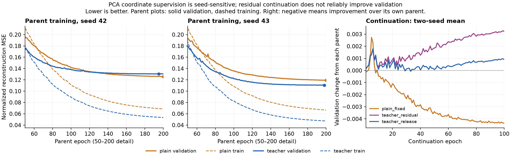

# PCA教师实验报告复核

## 结论

本轮有实质性进展：固定PCA逆变换、预测PCA坐标的学生方案，在不加坐标辅助损失的plain组就明显改善了综合历史重建及逐根变化、实体和量仓保留。额外λ0.25坐标监督没有两种子一致收益；残差和约200轮后才开始的教师释放没有全面通过预先声明的保留检查。

优先保留固定PCA解码、真实历史主损失这条研究路线。不能把方案整体收益归功于坐标辅助监督，也不自动替换价格路径更好的旧模型。本轮plain与plain_fixed仍是不同预算的研究候选，不能混作一个最佳结果。

## 完成情况及审计范围

- 文件 `babel_pca_teacher512_reports.tar.gz`，SHA256 `acd4402dfb0f7a41f316a8a63b42e70b9f2e926e1207e62c2ea620b6d6e1f86b`，119个成员。
- 退出码0，根和14组完成状态均complete；对应9fdbba1源码指纹。4个父组各200轮，10个分支各100轮；每轮4789个训练窗口、38步，累计68400次更新。batch128、micro64，两worker，RTX3080Ti、PyTorch2.8.0+cu128。
- 日志23:36:02至次日00:37:31，约1小时1分29秒。每轮约3.8–3.9秒，不含全部I/O；单worker训练峰值分配显存固定头约524MiB、残差头约528MiB，不是整卡总占用。
- 核验17个根报告指纹、38个worker报告指纹、1个坐标统计指纹，以及27个原来源报告/3个缓存元数据指纹。
- 检查14份完整历史、实际LR和λ序列、选中epoch、原验证指标、10条父子谱系与父/全局选模锁；分支初始验证指标与父模型匹配。
- 从逐窗口误差重算380个指标均值、原综合权重/变化跨度聚合，以及384个指标对照、10176个分组区间。研究集inventory与原架构报告一致；PCA512基线复现一致；teacher_residual两组与其父模型的逐窗口成绩完全相同。
- 归档不含28份best/last权重、两份教师坐标数组、原缓存和PCA二进制。本地复核指纹关系和报告内部一致性，没有重新运行真实权重推理或重拟合坐标统计。父组随机初始化epoch0没有独立导出的权重/分数可再计算；分支epoch0则有初始化验证报告可核对。
- GPU预检的因果前缀差为0；固定逆变换在完整验证集复现PCA，最大绝对差5.72e-6、RMS3.06e-7，低于预声明容差。

## 固定PCA方案带来的变化

以下均为两个种子的综合标准化MSE均值，越低越好：

| 方案 | 分配预算 | test | cross_research |
|---|---|---:|---:|
| 上轮attention_r512 | 从头200轮 | 0.308280 | 0.189535 |
| 本轮plain，固定PCA逆变换，λ0 | 从头200轮 | 0.232615 | 0.123014 |
| 本轮teacher，固定逆变换，λ0.25 | 从头200轮 | 0.235589 | 0.119522 |
| plain_fixed，同父固定头续训 | 200+100轮 | 0.228669 | 0.118202 |
| PCA256解析参考 | 无神经训练 | 0.164310 | 0.099518 |
| PCA512解析参考 | 无神经训练 | 0.040667 | 0.016723 |

plain相对上轮attention512的综合误差降低test24.54%/cross35.10%。另行重算的四个综合周配对区间均低于零。变化误差降低17.78%/22.01%，实体25.54%/16.63%，活动39.59%/42.26%；这三个目标族的四个区间均支持改善。

此比较是事后背景对照。虽然数据、骨干配置和200轮预算一致，新方案还改变了坐标投影、标准化和使用训练集拟合的固定PCA先验，不能据此证明“只换解码器”就必然产生这些收益。plain与teacher的同配置对照才能隔离辅助坐标监督。

单bar变化相关性，两个种子：

| 方案 | test | cross |
|---|---|---|
| 上轮attention512 | 0.499–0.505 | 0.542–0.562 |
| 本轮plain，200轮 | 0.640–0.649 | 0.673–0.690 |
| plain_fixed，额外续训 | 0.646–0.653 | 0.678–0.692 |
| PCA512 | 0.844 | 0.827 |

plain_fixed的单bar变化标准差比test约0.758–0.760、cross0.904–0.913。幅度更接近真实变化不代表逐根完全准确，相关性和误差必须同时看；仍未达到PCA512参考水平。

价格路径的代价没有消失。plain相对上轮attention512的路径MSE从0.06199→0.08167、0.00814→0.00911；收盘MAE从32.58→33.67bp、19.67→19.85bp。MAE四个事后区间均跨零，但路径MSE两个seed43区间显示退化。不能把综合改善写成所有价格指标都改善。

附加尾部诊断：plain_fixed在test中路径误差最大的9/984个窗口贡献约75.4%/78.5%的路径MSE，cross前4/453个贡献45.2%/49.2%。最大的窗口仍是ag/60/SHFE.ag2606（2026-02-11 14:00）及au/60/SHFE.au2606（2026-02-25 00:00）。这是定位清单，不认定原始行情错误，不删掉这些窗口重排名。

## 辅助坐标监督：更像PCA，但未稳定改善任务

teacher减plain的综合误差配对：

| 研究集 | seed | 差值 | 周区间 |
|---|---:|---:|---|
| test | 42 | +0.012059 | [0.007643,0.017086] |
| test | 43 | −0.006112 | [−0.008894,−0.002565] |
| cross | 42 | +0.004132 | [0.002290,0.006150] |
| cross | 43 | −0.011116 | [−0.013217,−0.009295] |

两个研究集都表现为seed42退化、seed43改善，不能只挑seed43或用cross均值掩盖失败。teacher收盘MAE两种子/两集都变差，四个区间高于零；均值test增加9.11%、cross13.18%。多尺度变化误差四个区间均退化。

坐标标准化MSE均值确实从plain的0.6835/0.6448降到0.6093/0.5476，但目标变好与坐标变准并不等价。辅助损失对按训练标准差缩放后的各坐标等权，而主目标包含缺失mask、路径/变化/实体/活动权重；两者优化偏好不同。可能存在权重分配或优化/泛化冲突，本轮不能唯一定位其原因。

plain的前32个坐标标准化MSE约0.09/0.08，后384个约0.84/0.80，尾部坐标更难学。这里不是逐坐标研究集R²，也不能直接换算成“丢失百分之多少信息”。

## 续训分支和epoch0回退

| 分支 | 父epoch，42/43 | 本分支选中epoch，42/43 |
|---|---|---|
| plain_fixed | 200/200 | 100/97 |
| plain_residual | 200/200 | 100/53 |
| teacher_fixed | 195/198 | 40/22 |
| teacher_residual | 195/198 | 0/0 |
| teacher_release | 195/198 | 46/10 |

teacher_residual的epoch0是已经训练195/198轮的父模型，不是随机模型，也不是漏跑：两个分支各100轮已完成，只是没有任何续训检查点超过父模型的验证综合分数。

plain_residual相对同父同预算plain_fixed的综合误差四个点估计都更差，其中三个周区间高于零；多尺度变化误差四个区间都退化。残差分支即使相对父模型改善，也不能忽略固定头等预算继续训练的收益。

teacher_release的选中epoch46/10对应λ约0.0204/0.2041，均未降到0。第50轮后λ确实归零，完整末轮成绩也已报告，但没有被验证选中。不能把选中结果称为“完全脱离教师后的成功模型”。

plain_fixed相对其父模型综合误差减少1.70%/3.91%，四个配对区间均支持改善；但cross实体误差两种子均退化，均值增加约3.96%。因此续训收益也不是全目标保留。

残差关闭/真坐标诊断不参与选模。示例plain_residual_s42：正常test综合误差0.22964，关闭残差0.22740，输入真实PCA坐标0.05611；后者使用真实历史解析坐标，不是学生成绩。这支持继续检查学生坐标估计及泛化，而不是用诊断分数冒充表示成功。

## 训练曲线与下一步

父组plain最优在200/200，固定头续训最优在100/97。不能沿用上一轮capacity512“95–131轮后全部过拟合”的结论；本方案plain仍有预算末端改善，尚不能宣称充分收敛。

teacher在早期两个种子都有验证优势：第50轮plain/teacher为0.19609/0.17598和0.19335/0.17991；第100轮为0.14171/0.13779和0.13536/0.12203。此后seed42出现反转，seed43仍受益。当前释放实验却等到父模型约200轮才开始，而且重置了优化器。它没有回答“在首次训练前半段就逐步退出教师”是否更好。

下一步建议保持固定PCA解码、不加残差，只补两个种子的早期退火对照：前50轮λ0.25，随后逐步下降至第100轮为0，总预算200轮，LR/数据顺序/初始化/优化器过程与已有父组相同，不中途重置。已有plain和constant-teacher父组作为只读来源固定的200轮对照，避免重新训练整个矩阵。这个日程依据验证曲线提出，仍是待验证假设，不能预设成功。

验收仍需两种子/两研究集的综合改善及价格/实体/量仓保留；若仍不稳定，保留plain路线，不继续搜索教师权重或残差组合。并行核查上述极端路径窗口与目标构造，之后再决定显式因果路径输入/时间汇聚或扩大原训练分区覆盖的单变量实验。研究集反复打开、多重比较未校正；既有模型不自动晋升，不能通过删除困难样本或平均掉退化来完成研究目标。

本次只复核和记录结果，未启动新的训练。
