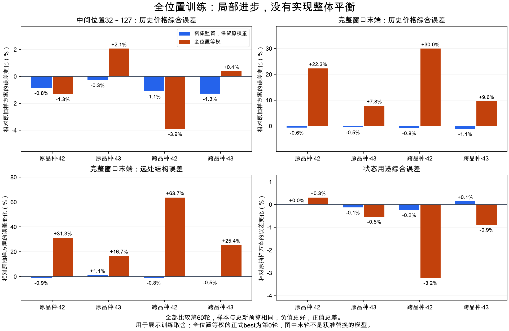

# Position Supervision768复核：短前缀显著改善，整体平衡没有改善

2026-10-03。来源`babel_position_supervision768_reports.tar.gz`，训练源码`736aa0e`；[事前协议](BABEL_POSITION_SUPERVISION768.md)、[机器复核记录](BABEL_POSITION_SUPERVISION768_REVIEW.json)。

## 结论

**用户提出的增加位置监督，确实让原来未直接监督的极短前缀更容易回读历史；但本轮全位置等权续训没有得到更均衡、可替换来源的模型。两个种子的正式best都回退到第0轮。保持原研究来源，结束这轮位置密度/等权配方，不继续补训或扫权重。**

正式两分支均为`no_confirmed_supervision_upgrade`。这不表示模型没有学到东西，也不证明从零开始全位置训练无效：本次只测试从同一已训练来源出发、固定60轮预算的续训。更密监督、等权监督、每个状态具有完整128根上下文，是三个不同问题。

## 1. 六组确实完整完成，比较预算一致

- 正常退出0、complete、source_unchanged=true，整轮73713.87秒，约20小时28分34秒。RTX3080Ti，PyTorch2.8.0+cu128、NumPy2.3.2，申请两worker、micro8。
- sampled/dense_matched/dense_all各两个种子，全部60轮、每轮4800组三视图、38更新；合计360 worker-epoch、13680更新、5184000视图、390528000个解码位置context。
- 每种子三组相同来源编码器和查询头起始签名、相同原始checkpoint、每轮样本/移位/辅助位置计划及学习率；各组编码器确有更新的远端签名记录。没有给旧模型更多本轮更新机会。
- 两种子源分别为Macro control验证best97/94，原架构/输入/价量系数不变。dense_matched保留原目标的期望位置权重，dense_all同时改变短前缀覆盖和位置权重。
- 12份best/last因果检查报告均passed；本地核验报告绑定，不冒称本地重新运行GPU因果检查。

| 组别 | s42选中轮次 | s43选中轮次 | 单组训练/验证轮累计用时 |
|---|---:|---:|---:|
| sampled | 60 | 58 | 1.13～1.20小时 |
| dense_matched | 60 | 59 | 7.34～7.71小时 |
| dense_all | **0** | **0** | 9.22～9.79小时 |

表内时间是每个worker的轮次累计墙钟时间，包含并行竞争，不能当独占GPU耗时或精确FLOPs。密集同权重约为普通组6.43～6.50倍，全位置约8.15～8.17倍；因此同epoch/样本/更新不等于同算力。

## 2. 保持原权重，只扩大位置覆盖：收益很小

dense_matched相对sampled的验证best：

| 研究分区/种子 | 32～127位置价格综合误差降低 | 共同近期路径误差降低 | 原用途综合误差降低 |
|---|---:|---:|---:|
| 原品种42 | 0.84% | 1.20% | 约0.00%（略差） |
| 原品种43 | 0.41% | 2.05% | 0.08% |
| 跨品种42 | 1.10% | 2.22% | 0.24% |
| 跨品种43 | 1.28% | 2.40% | −0.22% |

这是小幅点估计收益，不能称“没有变化”，但未达到事前至少5%的实质收益要求。位置增益0/8、近期增益0/8、用途增益0/8；相应5%判据区间支持未达到目标，不等于无任何非零收益。

活动保留32/32通过。其他保留318/320通过，剩余两项是原品种seed43的远处level对来源best/last：点估计仍在10%容差内，区间无法确认，**不是已证实远期退化**。主要停止理由是较大计算代价仅换来有限增量，而非把这两项不确定性当作严重损坏。

## 3. 全位置等权：学会了新的短前缀，损伤了完整窗口末端

因为正式best是第0轮，必须另外查看**实际训练后的第60轮**，才能解释它学到了什么。以下统一相对sampled第60轮，避免不同预算/检查点混比；这些末轮结果是取舍诊断，不替代正式选模。

| 指标：误差变化，负值更好 | 原品种42 | 原品种43 | 跨品种42 | 跨品种43 |
|---|---:|---:|---:|---:|
| 极短前缀2～31的历史价格综合 | **−98.17%** | **−98.25%** | **−99.69%** | **−99.72%** |
| 中间位置32～127的历史价格综合 | −1.30% | +2.07% | −3.89% | +0.38% |
| **完整窗口末端128的历史价格综合** | **+22.30%** | **+7.85%** | **+29.96%** | **+9.56%** |
| 完整窗口末端的远处结构 | **+31.29%** | **+16.72%** | **+63.68%** | **+25.42%** |
| 状态用途综合 | +0.31% | −0.53% | −3.21% | −0.88% |

“历史价格综合”沿用路径/单步变化/实体的固定价格评分，不能等同于收盘MAE。远处结构是原65..127年龄粗层级/变化；用途是原冻结状态的历史方向/波动等读出，不是未来预测。

极短前缀收益是真实报告中的误差下降，但比较对象原本没有这些位置的直接历史查询监督，不能把98%解释为整个模型提升98%、预测准确率98%或当前短期交易能力已经很好。编码器与查询头同时训练，本矩阵也没有将收益唯一归因于编码器信息增加。

末端读取共同过去16根的另一个指标也有取舍：原品种两种子和跨品种42误差分别增加32.27%/4.26%/56.00%，跨品种43则改善5.58%。所以不能说所有近期指标都恶化，也不能用这一个改善抵消四组远处结构的代价。

## 4. 为什么best会回到第0轮

不是没有训练，也不是报错或提前终止。六十轮均完成，只是全位置组没有一个训练后检查点通过原验证保护：

- seed42：60轮的near/far/gap保护全部未过；第60轮相对自身源，验证近期误差增加68.56%，远处增加51.99%。
- seed43：远处保护60轮全部未过；第60轮近期改善16.25%，远处仍增加17.75%。

第0轮回退的语义是“没有足够安全的替代检查点”，不是宣布最优epoch=0就没有学到新的短前缀。回退权重的train/val状态提取指纹与源一致，研究用途预测及原分项分数也与源一致；源大权重未在包中，核验范围以这些远端绑定和导出数组为限。

原协议904项比较全部复算：dense_all位置增益0/16、用途增益0/16、近期增益0/8、活动保留27/48、其他保留304/440。活动21项未过中15项区间支持超出容差；其他136项未过中86项区间支持超出容差，不能把所有失败都说成样本不足。

原绝对用途协议仍未全过：原品种全部未过，跨品种仍只有seed42系列通过；当前字段保留通过。没有“只要换成全位置就得到通用bar状态”的证据。

## 5. 机制解释与结论边界

代码能确认的位置权重变化：原末端128固定占查询位置权重20%，全位置后变为1/127≈0.787%，约降为原来的1/25.4；新增2..31短前缀占30/127≈23.62%。这些短前缀没有完整远期目标，所以“所有位置等权”并不意味着“所有时间尺度均衡”。

首个无更新梯度诊断也显示优化条件改变：全位置两种子的编码器梯度范数约3.47/4.03，普通抽样约0.087/0.062，全位置编码器和query触发裁剪。它支持任务分配/适配压力发生变化，不能据此唯一断言末端降权就是全部根因；覆盖、短上下文、源坐标适配和梯度裁剪都有可能参与。

最后20轮：dense_all seed42远处验证仅再改善0.78%，近期变差1.51%；seed43远处改善4.89%、近期改善5.72%，但保护仍未通过。普通抽样/密集同权重验证也仍在改善。因此不声称模型全部充分收敛，更不能推导“再训一定会恢复平衡”。本轮已经回答固定预算下的收益/取舍，停止追加。

本次只能检验已有模型续训，不能否定：从零开始采用统一监督、每个端点都有完整128上下文、或将未来预测目标加入编码器。上述各自需要独立对照，不能在本报告里用一句“全位置无效”全部排除。

## 6. 阶段决定与下一步

1. 用户的猜测已被正式检验并留下证据：增加原来缺少监督的位置，能改善那些位置的历史读取；当前等权续训没有改善整体平衡。
2. 保留原Macro control97/94作为既定研究来源，保留这轮sampled及各分支权重作记录；不自动以回读小幅改善重选未来实验来源。
3. 收束密集/全位置等权矩阵，不补训、不扫位置权重、不自动加层。不要花相近的20小时再追一个不足5%的密集解码增量。
4. H3“完整上下文的一致端点职责”继续保留，但现有滚动128端点本来已有训练、窗口重采样也已验证过收益；单纯再增加窗口端点不应包装成新架构突破。本轮不自动生成另一批端点训练。
5. 下一优先建议回到已规划的**冻结状态未来外推**：固定原来源，分开比较状态保持、单步/多步状态转移、同状态直接预测与raw直接预测，并坚持新增价格优于简单基线的判据。这能验证已有表示的另一项实质用途；不会被说成修复了历史长短期不均衡。未来外推代码仍待实施，本次不启动新GPU任务。

## 7. 本地复核范围

核验101份本轮完成绑定文件、100份源码、131份可用来源报告及源完成清单。12份模型权重与heads.npz未附，核对其绑定记录，没有本地模型重放、神经训练或重新拟合。

从已绑定原训练计划复算360轮样本、位置曝光、LR、更新及best选择；156份读出/780候选选择、317577个用途预测值、13139928个导出位置误差的汇总以及904判据均复算。842867次数值比较最大绝对差0。历史位置误差由报告逐窗口误差数组聚合，并非从未导出的原始历史解码预测重新计算；不能把该复核冒称独立GPU复现。已有源码及训练入口未修改，仅新增本轮复核记录和图。
