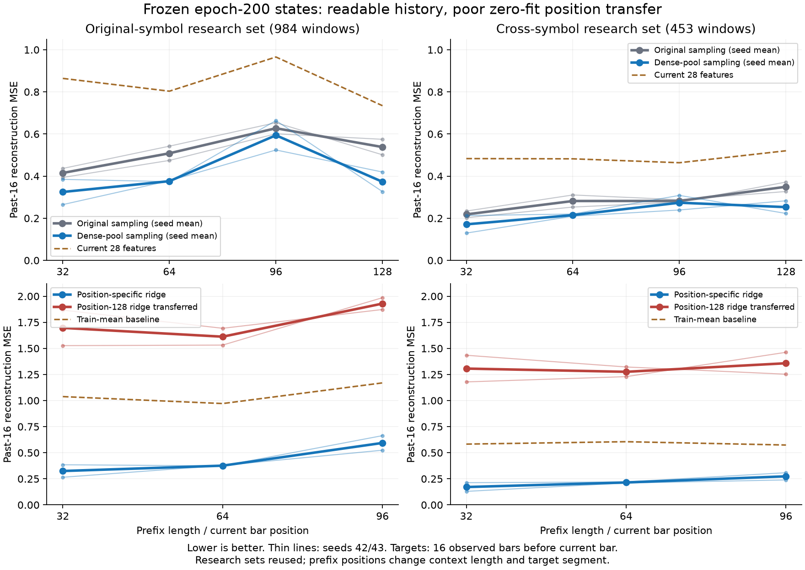

# 冻结逐bar状态读出报告复核

## 阶段结论

采样改进不仅帮助窗口末端：第32、64根的状态也能更好地读出此前16根历史。但第96根收益不稳定，不能宣称每根bar表示均改善。所有位置单独拟合的线性读出均明显优于current28基线；这支持状态保存了该基线以外的可读历史信息，不代表完整、无损或充分表示全部行情。

最强的新证据是跨位置读出失败：只在第128根训练的头，直接用于第32/64/96根时，原模型和采样模型都大幅退化。各位置有可读信息，但本轮未验证出可直接通用的读出方式。保留sampled两种子为窗口末端任务的优先研究候选，不晋升为已验证的通用逐bar编码器。

## 完整性与审计边界

归档：`babel_prefix_readout512_reports.tar.gz`；SHA256：`af89ba1c349ba233992acca13b7fbe6adf7a35ce736ce6a0a564430c77282edc`。实现提交35e2310，退出码0、complete。RTX3080Ti，PyTorch2.8.0+cu128、NumPy2.3.2，两个worker；日志15:37:58至15:42:10，约4分12秒。

- 冻结plain/sample ×42/43四个固定第200轮编码器，每个均已完成7600次编码器更新。四份原任务验证复现记录一致，本轮encoder_updates=0、source_unchanged=true。
- 四位置、五输入变体共20格；每格MLP100轮、19更新/轮，共38000次读出更新。原train4789、val978；test984、cross453。严格截断前缀；目标为当前bar之前16根，路径重新锚定。
- 核对119项可用文件指纹（包括索引中的目标统计重复引用）、源码与上一轮sampling归档来源身份。176项二进制文件引用按导出协议未附带，不能本地重新计算其文件哈希。
- 核对2000条训练历史的学习率、窗口数、步数；八个plain/sample配对头初始指纹相同。20格ridge均选验证最低的网格候选，MLP所选轮10–87，均与已导出的1–100轮验证最小值一致，和锁定文件相符。
- 重算1128个指标均值、1152项配对指标及30528个分组结果，均复现。change1/close_mae按原float32还原，其余误差按float64还原，避免JSON读回默认精度改变差值计算。
- 归档不含权重、原数组、优化器。本地未重跑真实推理或训练；epoch0验证只在未导出的检查点内，不能独立复核其数值。AutoDL代码在研究集提取前核验包含epoch0的选择并回放全部选中及末轮验证；本地验证其通过记录与可导出证据，不将其表述为本地权重重放。

## 同位置、同读出类型的比较

以下为两个种子的线性ridge综合误差均值，越低越好。目标为路径、实体、量仓三族标准化MSE等权平均，与旧128根重建主指标不是同一任务，不能直接比较数值。

| 当前bar位置 | 原品种plain→sampled | 相对下降 | 跨品种plain→sampled | 相对下降 |
|---|---:|---:|---:|---:|
|32|0.41507→0.32468|21.78%|0.21831→0.17106|21.65%|
|64|0.50831→0.37597|26.04%|0.28179→0.21489|23.74%|
|96|0.62723→0.59383|5.33%|0.28212→0.27376|2.97%|
|128|0.53789→0.37287|30.68%|0.34935→0.25279|27.64%|

32、64、128位置的两个种子、两个研究集，ridge综合误差周配对区间均支持改善。96位置必须分别保留：

| 研究集 | 种子 | sampled−plain综合误差 | 周配对95%区间 |
|---|---:|---:|---:|
|原品种|42|+0.01003|[-0.05235, +0.06092]|
|原品种|43|−0.07685|[-0.11344, −0.04696]|
|跨品种|42|+0.02045|[+0.01003, +0.03276]|
|跨品种|43|−0.03718|[-0.04899, −0.02695]|

跨品种seed42的96位置退化约7.10%，且区间支持退化；不能用种子平均的2.97%改善覆盖。该位置seed42的实体R²仅0.035，而路径R²为0.763，细节与路径的保留能力并不相同。

## 跨位置迁移

下表只展示sampled两种子均值。把第128根拟合的ridge及其训练标准化原样用于早期状态，与各位置独立拟合ridge比较：

| 位置 | 原品种独立→迁移 | 误差倍数 | 跨品种独立→迁移 | 误差倍数 |
|---|---:|---:|---:|---:|
|32|0.32468→1.69668|5.23×|0.17106→1.30644|7.64×|
|64|0.37597→1.61214|4.29×|0.21489→1.27554|5.94×|
|96|0.59383→1.92943|3.25×|0.27376→1.35753|4.96×|

原/新四编码器 × 三早期位置 × ridge/MLP × 两研究集，共48项迁移综合误差的周区间均支持退化；这些迁移误差也均高于各位置train均值基线。相比之下，current28的跨位置迁移没有这种数量级的恶化，支持继续研究编码状态的跨位置可读性。

不能据此断言信息消失或模型容量不足。现有训练只直接监督第128根状态，解码目标使用窗口内固定槽位；早期状态可能保留不同组织方式的信息。位置变更同时改变上下文长度、目标时间段和状态分布，本轮没有分离这些因素，也没有训练过覆盖全部位置的共享头。

## 线性与非线性读出的区别

四编码器 × 四位置，16格的ridge在验证集均优于本轮MLP；两个研究集也各16/16格综合误差更低。不是根据研究集挑出一个幸运头。更复杂读出在当前4789个训练窗口与规定训练方式下没有收益，不支持直接加大解码器。

MLP有明显过拟合迹象。例如sampled_s42_p128选11轮；训练误差从该轮0.2282降至末轮0.0878，验证误差却由0.2468升至0.3320。seed43对应10轮，验证0.3197升至0.4451。因此继续训练读出不等于改进表示，不能把训练loss下降作为扩大预算的理由。该结论不排除其他正则化/MLP训练方案有效，也不把闭式ridge与MLP称为等算力比较。

32个编码状态ridge结果均优于同位置current28，周区间均支持改善。但current28含EMA等历史摘要、只有28维，并非无历史或等容量控制。test上plain_s43_p128的MLP末轮相对current28未获得明确优势，完整结果保留，不扩大线性结果的结论范围。

## 下一阶段建议与停止条件

研究目标仍是每根bar对已观察历史的可复用压缩表示。本轮给出的优先问题是跨位置共用读出，而不是更多层数、维度、趋势规则标签或未来预测。

1. 先在冻结sampled两个编码器上，用train内多个前缀共同拟合一个共享历史读出头，保留相同16根相对历史目标和训练统计来源。复用本轮位置独立头作为可读性参照，并加未参与头训练的位置检验。不能把仅在128训练后零拟合迁移失败，直接当作必须修改编码器的证据。
2. 若共享头仍明显落后，才进入多位置历史重建辅助监督：保留原窗口末端PCA重建目标，增加由同一个头读取多个bar状态的目标，保护原有全窗口压缩能力。与同起点、同更新数、同采样/LR/批量、只延训原目标的控制配对，两种子均保留；记录局部标签曝光和额外计算量，不能只用旧200轮模型作对照。
3. 共同验收全窗口重建、各位置局部读出、未训练位置泛化、实体/量仓和一步幅度，按验证协议选模并保留固定末轮。若只在已监督位置改善或以末端能力明显退化换取局部收益，则不晋升。

此处为后续建议，未实现或启动新训练。仍使用已多次查看的研究集，区间未经多重比较校正，且按原128端点周/月分组；不能解释为新的独立留出证明。四位置及七类目标也不能代表全部bar、全部28维输入或无限历史。
