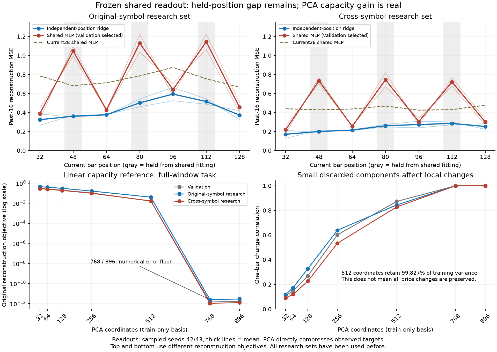

# 冻结共享读出与PCA容量曲线复盘

## 阶段判断

两个问题均获得了明确证据，但不能混为一谈：

1. 仅在四个位置拟合共享读出，尚未得到能泛化到中间位置的统一读取方式。各位置单独训练的参考头仍能读出历史，不能据共享头失败推断状态没有信息。
2. 当前固定512维PCA解码子空间存在可测的重建上限，尤其影响局部变化；768维PCA在本轮七通道历史目标上达到数值精度附近。扩到768值得正式神经实验，但本轮没有训练768维神经模型，不能宣称其性能已经得到证明。

不继续靠增加共享头训练轮数解决问题。下一阶段应进入编码器的多位置监督，并把512/768容量路线作为独立对照轴，不同时增加层数/头数/改特征后归因。sampled仍只保留为窗口末端任务的研究候选，不升级为已经验证的通用逐bar/流式表示。

## 完整性与复核

归档`babel_shared_readout512_reports.tar.gz`，SHA256：`898a43155b333562f86589ef2f8813fb362b4149d0a9a80eb0fab8493761d8b1`。来源实现1f7ea20，all退出码0、complete、encoder_updates=0、source_unchanged=true。RTX3080Ti，PyTorch2.8.0+cu128、NumPy2.3.2。日志17:21:39至17:25:52，约4分13秒。

- 五个MLP全部100轮、每轮75更新、合计37500读出更新；每轮19156行来自4789个原窗口的四个训练位置。共享头未使用48/80/112位置做拟合、输入尺度统计或选模。保留位置的独立ridge参考头是另行拟合的对照，不参与共享头选择。
- 核对84项可用文件指纹，源码及上一轮prefix归档身份、复制的四个锚点缓存摘要；234项二进制文件引用按导出协议未附带。五组500条历史的LR、窗口数、更新数、两对相同初始化、选模锁一致。
- 本次有独立导出的epoch0验证，可直接重算包括epoch0的MLP选择：plain42/43选19/23轮，sampled42/43选19/21轮，current28选92轮。所有100轮预算实际完成，不是提前停止。
- 共享ridge的alpha依次为plain42/43的.01/.01、sampled42/43的.0001/.0001、current28的.001。两个sampled均选择了网格最小正则，保留位置差不能拿来事后重选alpha。15个独立保留位置ridge均按各自验证选择。
- 重算2454指标均值、2664项配对指标/70596个分组结果，均复现。40组原独立ridge的240个逐窗口误差数组在原容差内复现。训练/保留位置聚合均先在同一窗口内平均，没有将位置当独立样本。
- 五种输入的ridge/MLP best/last，以及35个独立ridge，共50份验证回放记录通过。PCA512在val/test/cross与原控制的预测最大差均为0；896完整往返最大差分别8.58e-6、2.29e-5、8.11e-6（归一化目标单位）。
- 不含权重、PCA基矩阵、优化器或原数组；本地没有重跑真实推理/PCA拟合。核验了报告统计、来源摘要及通过的AutoDL回放记录，不将其称为本地复现权重。仅另外用合成log-volume序列核对了EMA恒等式。

## 共享读取：参与训练的位置尚可，未训练位置失败

下表为sampled42/43的综合误差均值，目标是当前bar之前16根的路径/实体/量仓三族等权MSE。与PCA曲线的原全窗口综合目标不同，不能横向比较数值。

| 研究集与位置 | 独立ridge参考 | 共享ridge | 共享MLP最佳 | MLP相对独立参考 |
|---|---:|---:|---:|---:|
|原品种，32/64/96/128|0.41684|0.58559|0.47788|+14.64%|
|原品种，48/80/112|0.45933|2.51395|1.10668|+140.94%|
|跨品种，32/64/96/128|0.22812|0.33946|0.26930|+18.05%|
|跨品种，48/80/112|0.24873|2.15306|0.73297|+194.69%|

这次共享MLP优于共享ridge，且五组验证选择也都支持MLP更低的误差。不能继续沿用上一轮“独立位置线性读出更好”的结论，断言共享任务也不需要非线性。但更好的共享MLP仍明显落后于独立参考：两种子×训练/保留位置×两研究集共八个综合比较，周区间均支持退化。

sampled共享MLP在保留位置的逐种子综合误差：原品种1.03105/1.18232，对应独立参考0.47913/0.43952；跨品种0.68401/0.78194，对应0.25503/0.24242。两种子、三个保留位置、两研究集共12项，均显著差于同位置current28共享MLP（未校正的周配对区间）；不是某一根位置或单个随机种子的问题。current28在训练位置和保留位置表现相近，表明任务本身并未在保留位置变成完全不可读。

末轮没有解决问题：sampled保留位置MLP均值进一步升至1.41978/1.01985。训练误差继续下降，而所选验证最佳在19/21轮；训练位置验证变化不大，保留位置却明显恶化，符合共享头对已见位置适应、插值不足的表现。这里没有证明所有可能的共享读出架构均失败。

训练集输入统计也显示位置分布变化：sampled保留位置均值相对共享训练均值的逐维标准化RMS为0.607–0.697，current28为0.018–0.021。此诊断只来自导出的训练均值/尺度，不能据此把根因单独归为正弦位置编码；上下文长度、目标片段和原始末端监督方式仍共同变化。

## 容量：512保留高方差，不代表保留全部局部变化

PCA只在原固定训练集拟合一次，报告全部预定维度。以下使用原128根历史任务的综合误差，非共享读出的局部主指标：

| PCA维度 | train解释方差 | 验证 | 原品种研究集 | 跨品种研究集 |
|---|---:|---:|---:|---:|
|32|44.726%|0.30962|0.45625|0.29178|
|64|56.306%|0.26231|0.39388|0.24806|
|128|70.984%|0.20197|0.30948|0.18931|
|256|88.353%|0.10488|0.16431|0.09952|
|512|99.827%|0.01667|0.04067|0.01672|
|768|约100%|1.43e-12|2.47e-12|1.06e-12|
|896|约100%|1.65e-12|2.82e-12|1.22e-12|

512维的目标R²仍很高，但一步价格变化没有完整保留：原品种相关性0.84368、幅度比0.88829；跨品种0.82748、0.90352。768维的两项均接近1。512维综合残差中，多尺度变化项的加权贡献分别约88.3%/83.0%；很小的被舍弃方差仍会显著影响差分指标，不能用99.827%推断容量已经足够。

当前Student把512维坐标送入固定512基向量的PCA逆变换。真实目标落在该子空间之外的分量不能由这个固定解码器精确补回；增加编码器层数也不改变输出子空间。另一方面，之前神经模型仍明显落后于同维PCA的实体/量仓重建，说明学习利用不足同样存在。当前state宽度与PCA rank绑定，本轮不能把两者影响独立分离，也不能证明任意非线性512维编码器都不够。

### 为什么768已经接近完整重建

这并非发现了“市场真实维度就是768”。当前目标本身有确定冗余：127根×7通道=889个有效槽位，且两个成交量目标来自同一个log-volume序列。按`activity_features`的EMA32定义，令`e[t]=log1p(volume[t])-prior_ema32[t]`、`d[t]=log1p(volume[t])-log1p(volume[t-1])`，有：

```text
e[t] = (31/33) * e[t-1] + d[t]
```

理想精度、对应成交量通道完整时，127根内至少有126个线性约束，相关仿射空间维度上限可降至889−126=763；线性标准化不消除这些约束。实际float32舍入会留下很小残差。源构造代码和合成序列验证支持该解释（合成最大差8.88e-16），与768曲线接近数值精度一致；归档未含完整基矩阵，未独立测出实际精确秩，也未确定512至768之间的最低充分维度。

PCA直接压缩这七个已观察目标，不等于从全部28维原始特征学出通用交易状态。完整目标重建也不保证适用于未来预测、分类或交易。



## 下一阶段建议

停止继续增加本轮冻结头训练轮数，进入编码器训练。建议将两个因素分开，使用512/768容量路线 × 仅末端/增加随机多位置共享历史重建的2×2矩阵，保留42/43两种子。

- 多位置分支保留原窗口末端重建目标，额外用同一个头重建随机历史位置之前的16根。训练位置不能只固定四个点；预先留出一组监督未覆盖的位置做插值检查。不能把监督后的位置改善当通用泛化。
- 固定原数据分区、采样策略、PCA/目标统计训练来源、200轮窗口曝光和更新预算；不同时改层数、头数、EMA、目标标签。768的PCA统计在train拟合，不能填充512状态后冒称等价预训练起点。
- 各分支从可比的初始化规则训练，跨宽度参数量和FLOPs不同必须记录，不把同更新数称为同算力。增加局部目标的标签曝光/计算量也单列。现有512末端对照仅在初始化、采样/LR、代码和预算严格复现后只读复用，否则重跑匹配对照。
- 容量轴同时改变当前绑定的state宽度和PCA解码rank，因此只能归因为这条容量路线；不能声称证明单独扩大embedding的因果效果。若需拆分二者，应另设固定rank的控制，避免本轮矩阵继续膨胀。
- 同时验收全窗口重建、位置独立和共享局部读出、保留位置、实体/量仓及一步幅度。按验证预定规则选模，保留末轮与两个种子；牺牲全窗口能力或只适应已监督位置，不晋升。

以上为后续实验建议，本次只完成报告复核，没有实现或启动新的编码器训练。当前两个研究集已反复使用，区间未经多重比较校正，窗口仍继承128端点资格筛选；位置插值不等于新市场或线上逐bar无选择偏差验证。
