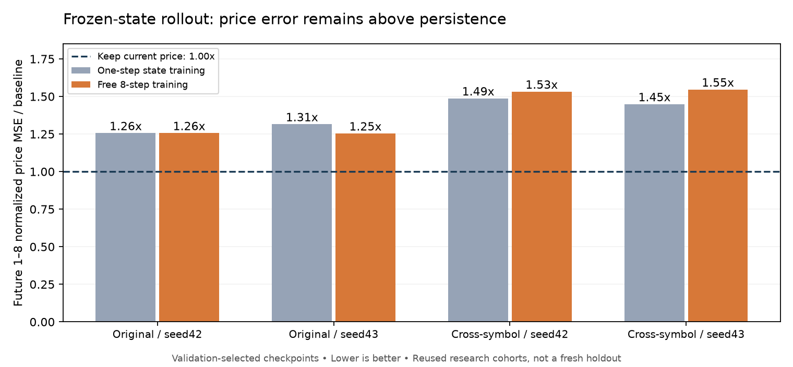

# State Rollout768复核：状态移动可学习，新增价格能力未通过

2026-10-03。输入`babel_state_rollout768_reports.tar.gz`，SHA256 `a389645f63b40545c454c969797416a17ef5eeda27c560ddf4878d5aab27b1b7`。协议见[BABEL_STATE_ROLLOUT768.md](BABEL_STATE_ROLLOUT768.md)，计划分支见[BABEL_STATE_ROLLOUT768_PLAN.md](BABEL_STATE_ROLLOUT768_PLAN.md)。

## 阶段结论

本轮工程完成，研究门槛未通过。原Macro control97/94编码器及历史查询头均未训练；新增20个状态转移/直接价格模型各完成60轮。**向量的下一步变化有很大部分可学习，但尚未得到优于“保持当前收盘价格”的新增行情预测。** 原历史表示不被本轮替换，已建立的历史压缩能力也未被本轮推翻。

主候选N8在两个种子、两个研究集上，未来1..8累计价格标准化MSE均更差；1..32每个h的点估计也都比基线差。这里没有“前几根可靠、之后才失效”的已验证区间。9..32是超训练长度压力测试，不可用其失败单独否定训练内能力，但训练内本身已经未胜基线。

## 完成度与独立复算

- 20组×60轮＝1200个worker-epoch，22800次更新，5740800次origin曝光，45926400次未来目标曝光。不同训练origin只有4784个，重复epoch/八个相关标签不冒充数千万独立行情样本。
- RTX3080Ti、Torch2.8.0+cu128、NumPy2.3.2；双worker、有效batch256、micro128。累计worker训练及每轮验证计时403.25秒；从00:59:06启动日志到01:16:14导出记录约17分钟，包含来源核验、缓存、加载、评价与导出，非精确训练墙钟计时。
- 本轮completion绑定133项，报告中可用129项全部哈希相符；4个远程状态缓存未打包，符合协议。131份可用Macro来源报告及原completion指纹匹配，两个旧大模型不在本地报告中。101个当前绑定源码模块一致。
- 20组采样顺序、1200轮实际预算、epoch0/最佳轮/LR选择复算一致。40个小模型best/last已导出，20个末轮签名均不同于对应初始化；直接价格best0确实是原零输出，不能说没有进行训练。
- 从逐行价格预测重算1999296个预测值对应的主指标、曲线、同时置信带和42项判据；45583个汇总数值最大差0。4306176个导出状态逐行诊断值的聚合匹配；由于未导出完整状态轨迹，不能声称已从原始768维张量独立复算状态误差。
- 本地1251份原始CSV哈希与绑定库存全部匹配，独立重建7187个有效origin的未来价格/历史尺度及17个剔除原因，核验完整128+32分区边界；110个分组检查匹配，浮点最大差约3.22e-14。预训练val oracle/identity与最终val对应逐行预测完全相同。
- 本次为报告、权重结构/指纹和CPU原始数据审计，无优化器更新、无真实旧编码器推理。仍未本地复演远程E/D和完整状态缓存。重复使用的研究集不冒充新时间留出。

| 分区 | 原origin | 保留 | 剔除 | 缓存唯一端点（每种子） |
|---|---:|---:|---:|---:|
| train | 4789 | 4784 | 5 | 43056 |
| val | 978 | 969 | 9 | 31977 |
| test | 984 | 984 | 0 | 32472 |
| cross_research | 453 | 450 | 3 | 14850 |

## 价格结果：先与简单对照比

验证选择的简单基线是flat，即未来收盘始终等于起点收盘。验证1..8误差为1.265142；趋势8、趋势32、训练均值分别1.790324、1.411656、1.267755。不能事后用研究结果换成另一个基线。

下表正数表示N8更差，主指标为1..8累计收益标准化MSE，**不是价格百分比误差或方向准确率**。

| 队列 | flat主误差 | N8主误差 | 相对flat | N8相对N1 | 新增逐步收益MSE相对flat |
|---|---:|---:|---:|---:|---:|
| test/s42 | 1.135967 | 1.426462 | +25.57% | +0.002% | +24.69% |
| test/s43 | 1.135967 | 1.423883 | +25.35% | −4.67% | +22.30% |
| cross/s42 | 1.055545 | 1.616745 | +53.17% | +3.03% | +47.01% |
| cross/s43 | 1.055545 | 1.631426 | +54.56% | +6.72% | +37.24% |

- N8相对flat的5%增益、相对raw的5%保留、增量误差10%保留均四组未过。价格及增量误差的区间支持明确不利，不能描述为“只是样本不够显著”。
- N8绝对误差95分位相对flat增加7.94%、5.22%、10.17%、15.32%；四组10%非劣区间都未获支持，但各区间跨过边界，**不能把四项全部称为已统计证实超过10%**。
- N8优于L1得到四组支持；优于同结构单步N1仅test/s43有支持，其他三组区间跨0。N1/N8各自验证选LR，属于各自相同搜索机会后的方案比较，不能把全部差异归因于单一训练变量。
- 两个直接价格组（状态→价格、原始输入→价格）所有8次拟合均选择epoch0，其研究best与flat逐行相同。末轮更差，并非新读取器带来了增益，也不能以“原始输入也差”证明现有embedding包含全部未来信息。

## 学到了什么，没学到什么

单步N1的第1步状态误差，相对复制旧状态下降95.02%～95.62%；标准化状态余弦约0.961～0.967。N8在第8步状态误差相对复制下降61.42%～64.95%。这些是实质的状态动力学拟合证据，但不是95%的行情预测准确率。

滚动窗口每次删去旧bar、移动位置、加入新bar。前两部分主要由已知历史决定，状态坐标的移动也可能很强。因此向量的大部分变化可预测，最关键的新价格分量仍可能没有优势。上述解释与结果相容，**不是已经把可预测部分严格分解成旧历史/新行情的因果证明**。

真实未来状态交给同一个旧查询头，研究1..8价格主误差仅0.005585/0.001664和0.008234/0.002514，远低于实际预测误差。说明原头在真实未来状态上能读出对应过去起点与未来端点的价差；该诊断使用未来行情，不能部署、不是数学下界，也不能把二者误差直接相减。本轮问题至少不宜简单归为“原解码器完全不会读”。预测状态可能未保留关键创新或偏离真实状态分布，点预测目标也可能不足；当前证据不唯一识别根因。

“共享127根就必然很近”也不是当前坐标的事实：复制状态相对于下一真实状态的标准化余弦仅约0.154～0.205。可复用语义不要求欧氏距离随时间单调，但后续不得把这种近似当成已满足的先验。

## 选模与预算解释

| 组 | s42所选LR / best | s43所选LR / best |
|---|---|---|
| L1 | 3e-4 / 1 | 3e-4 / 2 |
| N1 | 1e-3 / 46 | 1e-3 / 58 |
| N8 | 1e-3 / 33 | 3e-4 / 25 |
| Z-direct | 3e-4 / 0 | 3e-4 / 0 |
| Raw-direct | 3e-4 / 0 | 3e-4 / 0 |

N8所选两组的训练loss在末20轮仍分别下降约13.53%/9.56%，但末轮验证价格误差比各自best增加约3.99%/19.24%。不能说充分收敛，也不能据训练loss继续下降就要求加训。L1的单步状态拟合更低而自由价格漂移更严重，直接价格组训练拟合与验证表现也背离。当前有限训练协议中未得到稳定预测增量；不能外推为更多独立数据、不同预训练或未来分布建模永远无效。

## 分支与下一步

| 分支 | 当前决定 |
|---|---|
| H1/H2密集与全位置监督 | 保留上轮短前缀收益/末端损伤结论，不重跑；从头全位置训练仍未验证 |
| H3完整上下文一致端点职责 | 保留假设；已有滚动窗口训练不包装成新实验，需要先提出区别于旧方案的目标 |
| H4冻结确定性状态外推 | 本矩阵关闭；保存权重与诊断，不追加轮数/LR/深度，不晋升预测器 |
| H5用预测任务改编码器 | 原始输入直接预测也无增益，未出现“raw有用而state无用”的定位证据；不据此自动启动联合重训 |
| 未来分布/随机创新 | 保留条件分支，尚未实现或授权开跑；先定义比简单历史波动/噪声模型更强的概率评价，再论证是否值得训练 |

研究主目标仍是可复用的因果价量状态，不把“拟合唯一未来价格”悄悄变成唯一成功标准。此次没有必要再补一次同配方训练；下一核心方案先围绕表示要保留的可复用信息及独立可检验用途论证，不能因本轮失败就自动扩大模型或新增随机生成头。
