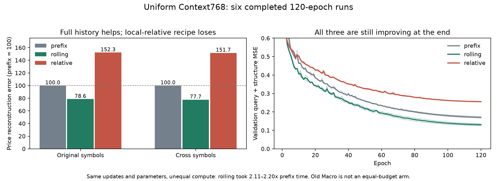

# Uniform Context768复核：完整历史监督有收益，局部相对注意力未通过

2026-10-03。报告`babel_uniform_context768_reports.tar.gz`完成、exit0，日志02:31:30～11:26:03，约8小时55分钟。RTX3080Ti、单worker、micro8、batch128。六组各120轮、共27360更新；没有早停或未完成对照。原Macro继续保留，本次没有新训练入口。

## 直接结论

**值得保留的是“每个受监督bar拥有完整历史”的训练方向；本轮新设计的局部相对注意力失败。** 这两件事不能混为一个成功或失败。

相对同种子、同120轮的传统prefix组，完整滚动128的rolling组：

| 指标 | 原品种，两种子范围 | 跨品种，两种子范围 |
|---|---:|---:|
| 平衡价格误差下降 | 19.82%～22.91% | 21.86%～22.74% |
| 最近1～16根价格误差下降 | 42.21%～56.95% | 46.29%～53.20% |
| 最远65～127根价格误差下降 | 17.61%～20.01% | 18.09%～20.68% |
| 历史成交/持仓活动误差下降 | 20.91%～23.51% | 21.02%～22.90% |
| 末端状态价格误差下降 | 19.01%～21.10% | 22.15%～22.55% |

四组“至少5%平衡价格改善”的月级配对区间均支持；末端也改善，没有用它换取中途平均值。这里验证的是**完整上下文及其目标覆盖的整个配方**，不是只改了一个损失系数。rolling耗时是prefix的2.11～2.20倍，因此不证明等算力收益，也不能说新架构一定更高效。

左图以对应prefix误差=100归一化后对两种子平均，越低越好；右图粗线为双种子平均，细线为各自实际曲线，纵轴截取0～0.6用于观察后段。旧Macro预训练历史不同，未作为等预算柱状对手。

## 新局部相对注意力的结果

relative相对完整滚动rolling的平衡价格误差增加：原品种105.24%/82.51%，跨品种106.01%/84.60%。近、中、远、历史活动以及末端/中途保留均失败，60项历史增益/保护检查全部失败，且区间支持实际伤害超过预定边界。用途保护12项只过8项；剩余主要是波动保留不确定和一个原品种综合用途不确定，不能把这些不确定项全部写成已证明有害。总计8/72通过，双种子双研究队列均未通过。

其块边界不变性确实成立：训练前及训练后抽检通过，同历史独立128与长块状态差异为浮点量级，未来扰动差异0。这说明实现了设计的因果职责，**不说明这种局部连接能保留足够信息**。四层局部注意力需要逐层传递远处信息，可能影响学习；现有实验同时更改了连接和位置偏置，尚未将原因隔离，不能断言是相对位置本身无效。

按事前计划结束这一有限配方，不追加距离核、层数或学习率搜索。不是宣布所有相对位置或有限记忆架构失败。

## 为何仍不升级主模型

1. rolling相对原Macro的价格误差仍高26.67%～179.75%，历史活动也明显更差。原Macro有更长预训练，因此这不能作为从头架构不可能追上的证据；但现有新权重也没有足够理由替换它。
2. 历史重建改善未转化成一致用途改善。rolling相对prefix的冻结用途误差，原品种s42增加2.78%且配对区间支持变差，s43下降2.01%但区间不确定；跨品种下降6.10%/11.13%，仅s43改善有区间支持。不能只选跨品种好结果。
3. 新rolling仍具有实际可读信息：16/64根方向效率R²约0.923～0.972，当前七字段R²约0.962～0.998；16根波动在原品种约0.694～0.726，64根波动约0.993，趋势直线度约0.156～0.247。它们是截至当前的历史描述量，不是未来预测成绩或交易指令。用途综合低于raw/PCA的点估计也不能替代完整保留判据。
4. **不能说120轮已收敛。** 六组best分别120/120/120/120/120/119；最后20轮验证目标仍改善约2.42%～6.44%，训练损失也下降。结束本轮基于有限预算与比较结果，不是依据平台期。尤其rolling不应因为处于上升期就被永久否定，也不应因此自动无限续训。

## 下一步的专业判断与计划分支

下一优先问题收敛为：**保留原全局注意力和已训练主模型，在同源续训中引入完整历史监督，能否保住既有能力并取得新增收益？** 实施前需同时设计原方式续训对照及近似等算力对照，区分上下文收益、训练目标覆盖和额外计算；不能把本轮从头120轮与旧长课程比较后直接宣布赢家。具体预算、LR、选模与保护必须另行锁定，本次没有发布可执行的新矩阵。

这也是H3的有限阶段结论；继续保留用户的从头全128位置同时等权、多分辨率共同物理历史对齐，以及满足证据条件后的联合预测/随机创新分支。本轮仍只抽五个位置，不能假称完整验证了全位置等权猜测。上一轮确定性未来状态外推失败的结论保持原样。

## 核验与边界

- 43个可用completion绑定文件、102项源码哈希匹配；原Macro来源身份与上一轮完全相同。源码和训练权重未改。
- 重算720轮采样顺序/位置hash、成对初始化记录、学习率、120轮预算和验证选模；六组各4560更新，总3448080原端点、17240400监督状态曝光，参数均30187399。初始化实际权重未随包提供，核验是记录与固定源码层面的。
- 核对221个冻结读取器的1105项alpha候选，所选均为验证最低项。重算314483个用途预测值所对应评分、478128个历史逐窗口误差的聚合、分组、配对区间和72项判据，共5390个标量匹配，最大差0。
- 独立读取1251份本地CSV并验证原指纹；完整255历史资格匹配train4789/val978/test984/cross439，跨品种14条排除。重新生成1423研究端点的18499个用途标签及全部可用性mask，最大差8.89e-16。
- 报告按设计省略12个神经检查点、8个输入/状态缓存及readout_weights.npz。没有本地模型推理或训练，不能从这个包单独验证全部历史预测→误差过程、读取器系数或重拟合PCA；原始逐历史预测仅导出固定例子。已能独立复算上述导出评分，不把边界隐藏成完整权重复放。
- `test`与`cross_research`都是反复使用的研究集，不称新增独立留出。旧warning只是预检日志把带梯度张量转标量，本轮完整通过；不为消除外观警告改动已绑定的训练源码。

机器可读记录：[BABEL_UNIFORM_CONTEXT768_REVIEW.json](BABEL_UNIFORM_CONTEXT768_REVIEW.json)。本次仅复核、更新计划与记录；原训练源保持不变。
