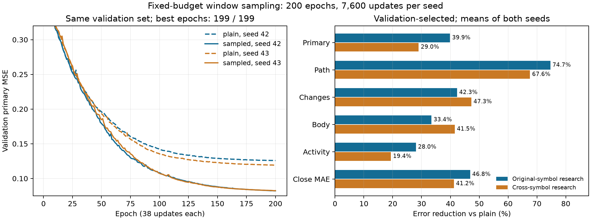

# 固定预算窗口采样报告复核

## 阶段判断

本轮通过预先声明的探索性门槛：sampled_s42/s43相对各自plain控制，在test与cross_research的综合误差均改善；价格路径、变化、实体、量仓及收盘MAE均有改善，两种子/两研究集/最佳轮与固定末轮的六项主要误差，其全体按周配对区间上界均小于0。不是挑选一个种子或偶然挑中一个最佳轮的结果。

将sampled两个种子保留为下一阶段优先研究候选，旧plain继续作为对照。主模型和长历史流式方案不自动替换。结论限定于已观察历史的窗口末端表示与固定PCA重建任务；不能推及未来预测、交易收益或所有bar状态均已验证。

## 完整性与预算

归档：`babel_sampling512_reports.tar.gz`，SHA256为`fbed2874d39095467e09ae510b5bb43bba81a0bf969abb6fe3ba67e979df1816`。命令all，退出码0、status=complete、source_unchanged=true。来源代码对应a53b68d；RTX3080Ti，torch2.8.0+cu128、NumPy2.3.2。日志从13:32:37到13:48:00，约15分23秒；各组训练累计约769秒，并行执行。

- 两种子各200轮、38更新/轮、7600更新、957800窗口曝光。无教师辅助、无残差、原模型/PCA/统计/学习率日程和有效batch128/micro64不变。两组均按原验证主指标选中199轮，epoch0初始化复现记录通过。
- 候选38549、唯一合约周期bar684320；全部4789旧端点的x/y/mask精确复现，最大差0。两种子最终均覆盖整个候选池，成员抽样次数分别7–45和9–44。每轮窗口曝光相同，不代表每轮独立信息量相同：首轮唯一bar分别412688/409840，旧非重叠窗口为612992。
- 核对18份根报告、25份附带依赖文件、6份新worker附带文件、源码指纹及旧报告来源；重新生成400轮采样计划并逐项比较，核对所有端点、选模、预算和缓存身份。
- 重算200个指标均值、48项配对指标/1272个分组区间；80组旧plain/PCA逐窗口误差数组在原容差内复现，旧plain固定末轮均值也复现。
- 归档不含检查点、优化器或原数组，本地没有重跑真实模型推理；二进制核验及新旧模型推理来自通过来源校验的AutoDL记录。没有本地神经更新。

## 核心结果

下表为两个种子均值，均使用各自验证选中的检查点。百分比是均值误差的相对下降。

| 指标 | 原品种研究集plain→sampled | 下降 | 跨品种研究集plain→sampled | 下降 |
|---|---:|---:|---:|---:|
|综合MSE|0.23262→0.13989|39.86%|0.12301→0.08733|29.01%|
|路径MSE|0.08167→0.02070|74.66%|0.00911→0.00295|67.58%|
|多尺度变化MSE|0.30426→0.17551|42.32%|0.08634→0.04552|47.27%|
|实体MSE|0.66526→0.44287|33.43%|0.23820→0.13930|41.52%|
|量仓MSE|0.24189→0.17408|28.04%|0.26094→0.21039|19.37%|
|收盘路径MAE，近似bp|33.67→17.90|46.83%|19.85→11.67|41.21%|

逐种子综合误差下降：test为39.85%/39.87%，cross为30.10%/27.87%。四个周配对95%区间分别为[-0.13509,-0.06063]、[-0.14984,-0.05410]、[-0.04259,-0.03336]、[-0.03900,-0.02858]（sampled−plain，绝对MSE差）。固定200轮综合误差均值下降39.97%/29.01%，结论一致。

按窗口统计，test两种子分别99.59%/99.09%的窗口综合误差更低，cross为99.56%/98.90%。这说明改善不只由少量大幅行情驱动；窗口并非独立试验，该比例不是成功概率或交易胜率。预定义分组中未发现有支持且区间下界大于0的最佳轮主要误差退化；多组区间未经多重比较校正，缺乏支持的子组仍不做强结论。

## 不能忽略的剩余问题

1. **一根bar的变化更对齐，但幅度仍被压缩。** test的一步变化相关性由0.640–0.649升至0.787–0.788，cross由0.673–0.690升至0.824–0.826；但重建/真实变化标准差比test从约0.729降至0.716–0.718，cross从0.867–0.878降至0.804–0.805。标准差比的目标是1，这项诊断方向变差，不能写成所有指标都改善。它不直接区分信息未编码和固定读出/损失导致的幅度收缩。
2. **仍未全面接近PCA512。** 综合误差test为0.13989对PCA512的0.04067，cross为0.08733对0.01672；实体和量仓重建仍明显落后。另一方面，sampled的变化误差及收盘MAE均值已经低于PCA512，cross路径MSE也更低。这不矛盾：PCA以整体欧氏投影为目标，不保证每个加权分项最优；它直接编码解析构造的真实历史目标，不能因此声称神经模型全面超过PCA。
3. **末端附近的细节仍较难。** 最近15根的量仓MSE在两个研究集均高于最旧64根，虽相对旧模型明显改善。固定PCA坐标读出有用，不代表当前状态已无损保存全部局部信息。
4. **不能宣布充分收敛。** 两组最佳均199轮。验证主误差150→200轮由0.08806→0.08222、0.08766→0.08249，仍下降约6.6%/5.9%；190→200约下降0.9%/0.7%，速度放缓但不能据此断言平台。训练指标来自每轮不同窗口，不能把它与旧固定池的训练均值当成同样本直接比较。

## 对研究路线的含义

保持架构与更新预算，就取得跨种子的明显收益，说明训练窗口的覆盖与观察位置是此前配置的重要限制因素之一。本轮同时改变了窗口位置、部分原始bar覆盖及品种/时间曝光，不能把全部收益单独归因于其中一项，更不能推断模型容量已足够或架构最优。

当前确实验证的是128根窗口末端状态：损失直接读取h[127]并重建127根历史。因果前缀测试只证明早期状态不读取后面的bar，不证明h[31]、h[63]等中间状态已具有同等可读性。这与用户要求“每根bar都是前序行情的压缩状态”仍有需要补上的证据。

下一阶段优先冻结新旧两个种子的编码器，用同一训练来源和相同容量的读出器，比较窗口内不同位置状态对当时已观察历史的保存能力；同时检查局部变化幅度与量仓信息。先用线性读出定位可直接读取的信息，再用小型非线性读出区分读出难度与表示限制；读出只是诊断，不把编码器主任务改为拟合人工趋势规则。所有目标限制在对应bar之前/当时已观察到的数据，预先固定位置、历史范围和选模协议。

目前仅提出该诊断方向，没有实现或启动新训练。暂不同时扩模型、改损失、延长预算，以免失去已建立的对照；若后续延长训练，明确这是新的预算实验。test984和cross453仍为反复使用的研究集，本次改善不能替代新的独立留出验证。
